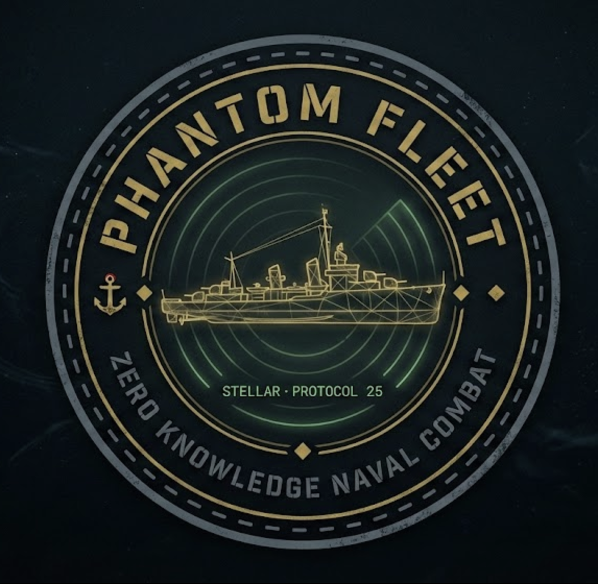
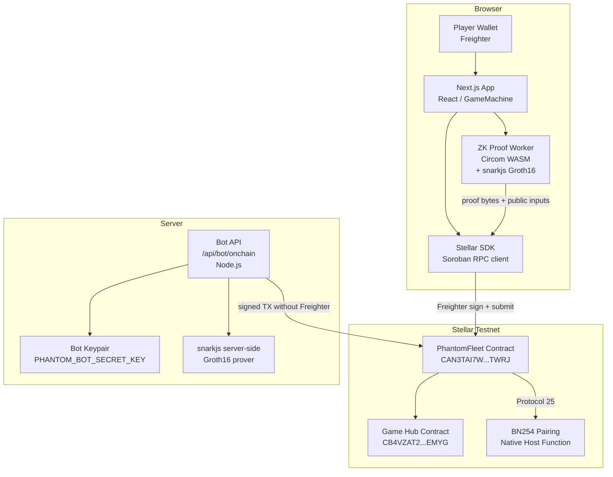
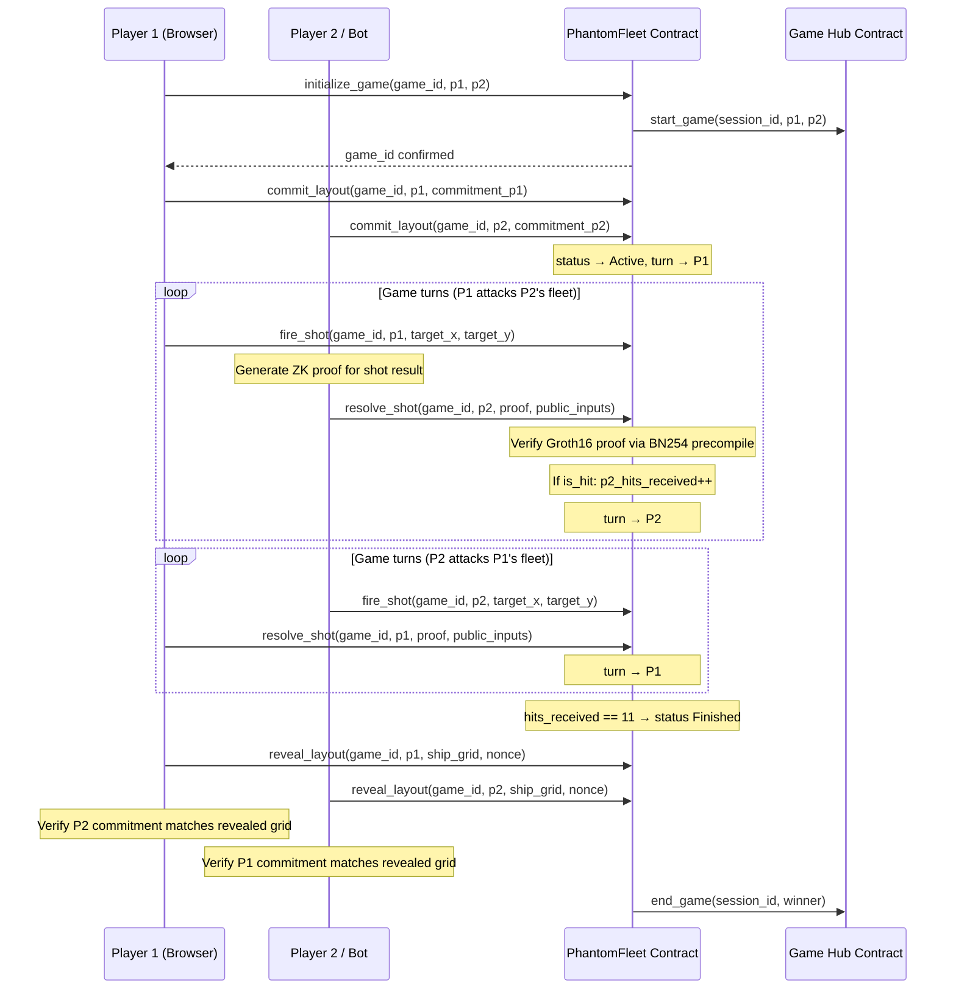
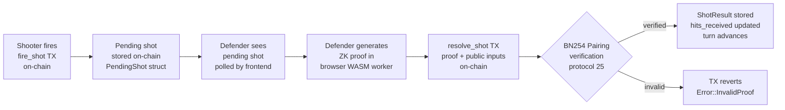
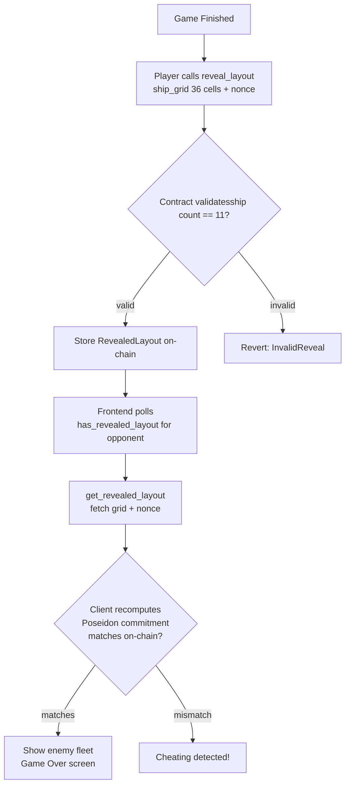
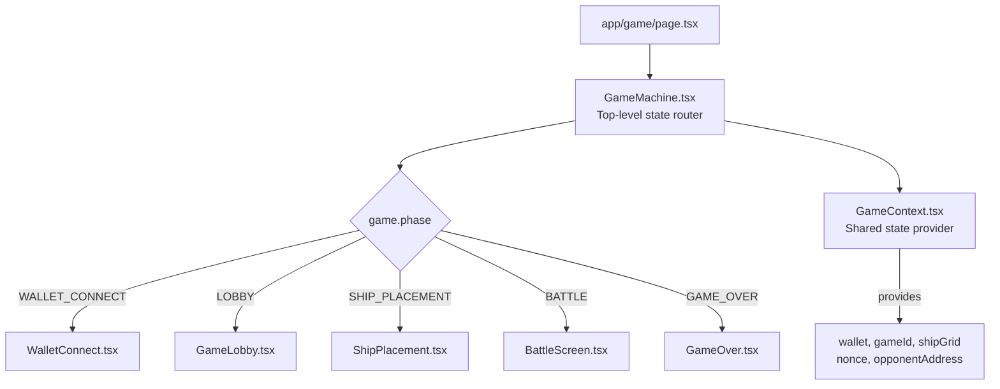
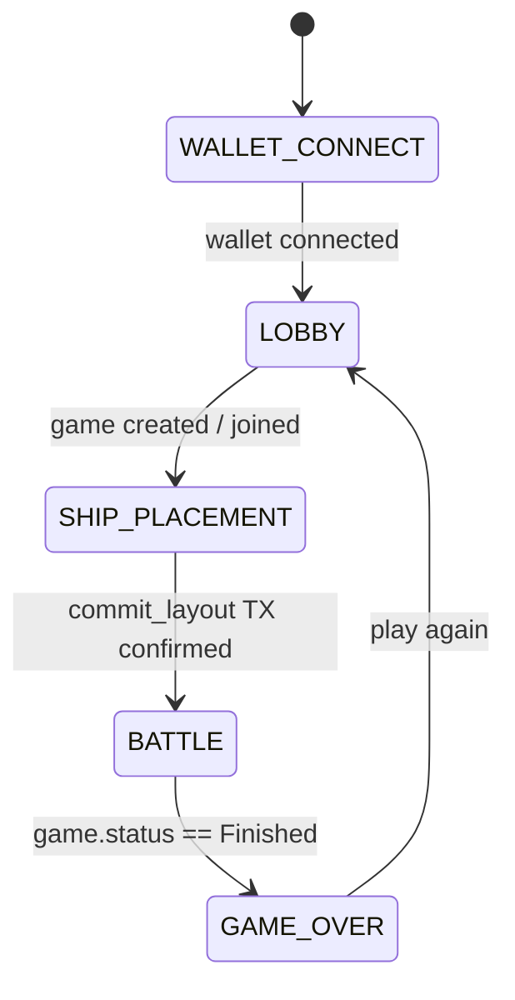
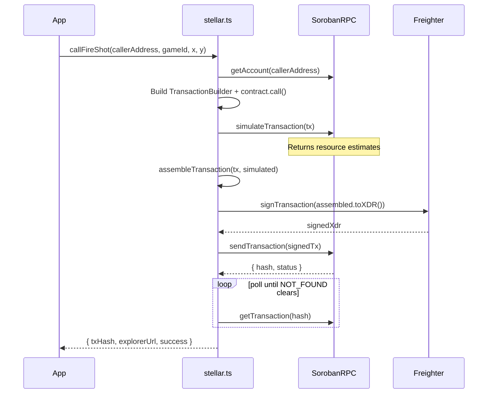
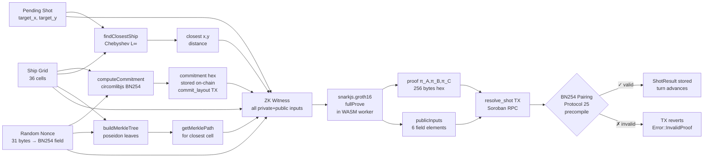

# PHANTOM FLEET

<p align="center">
  
</p>

<p align="center">
  <strong>Zero-Knowledge Naval Combat on Stellar Blockchain</strong><br/>
  <em>Stellar · Protocol 25 · BN254 · Groth16 · Poseidon · Soroban</em>
</p>

<p align="center">
  <a href="https://github.com/pramadanif/phantomfleet">GitHub Repository</a> ·
  Deployed on Stellar Testnet
</p>

---

## Table of Contents

1. [Project Overview](#1-project-overview)  
2. [Why Stellar Protocol 25?](#2-why-stellar-protocol-25)  
3. [Architecture Overview](#3-architecture-overview)  
4. [Game Rules & Ship Layout](#4-game-rules--ship-layout)  
5. [ZK Circuit — Deep Dive](#5-zk-circuit--deep-dive)  
   - [5.1 Circuit Inputs & Outputs](#51-circuit-inputs--outputs)  
   - [5.2 Commitment Scheme](#52-commitment-scheme)  
   - [5.3 Proximity — Hot & Cold Rings](#53-proximity--hot--cold-rings)  
   - [5.4 Chebyshev Distance](#54-chebyshev-distance)  
   - [5.5 Merkle Proof Inside the Circuit](#55-merkle-proof-inside-the-circuit)  
   - [5.6 Constraint Count & Soundness](#56-constraint-count--soundness)  
6. [End-to-End Game Flow](#6-end-to-end-game-flow)  
   - [6.1 High-Level Sequence](#61-high-level-sequence)  
   - [6.2 Detailed Turn Flow](#62-detailed-turn-flow)  
   - [6.3 Reveal Phase](#63-reveal-phase)  
7. [Soroban Smart Contract](#7-soroban-smart-contract)  
   - [7.1 Data Structures](#71-data-structures)  
   - [7.2 Public Functions](#72-public-functions)  
   - [7.3 Error Codes](#73-error-codes)  
   - [7.4 On-Chain Proof Verification](#74-on-chain-proof-verification)  
8. [Frontend Architecture](#8-frontend-architecture)  
   - [8.1 Component Tree](#81-component-tree)  
   - [8.2 Game State Machine](#82-game-state-machine)  
   - [8.3 ZK Proof Worker](#83-zk-proof-worker)  
9. [Bot System](#9-bot-system)  
   - [9.1 Bot Grid Layout](#91-bot-grid-layout)  
   - [9.2 Bot API Route](#92-bot-api-route)  
   - [9.3 Deterministic Nonce](#93-deterministic-nonce)  
10. [Wallet & Transaction Flow](#10-wallet--transaction-flow)  
11. [Deployment Guide](#11-deployment-guide)  
12. [Testing & E2E Scripts](#12-testing--e2e-scripts)  
13. [File Structure](#13-file-structure)  
14. [Contract Addresses](#14-contract-addresses)  
15. [Environment Variables](#15-environment-variables)  

---

## 1. Project Overview

**Phantom Fleet** is a fully on-chain, zero-knowledge battleship game built on the **Stellar blockchain** using **Soroban smart contracts** (Protocol 25). It combines:

- A **6×6 grid naval combat** system where ship layouts are secret
- **ZK proofs (Groth16 / BN254)** to verify hit/miss results honestly without revealing the layout
- **Poseidon BN254 hashing** — same in the browser (circomlibjs), in the Noir circuit, and in the Soroban contract
- **Proximity feedback** — even on a miss, the defender must prove how far the nearest ship cell is (hot/cold rings), giving players spatial intelligence without leaking exact positions
- **Freighter wallet** integration for signing on-chain transactions
- **Bot mode** — a server-side AI opponent that automatically commits, fires, resolves shots, and reveals its layout

This game is fully trustless: the only trusted component is the ZK verifying key deployed on-chain. The contract's `resolve_shot()` function calls the BN254 pairing precompile introduced in **Stellar Protocol 25** to verify every proof. Players cannot lie about hits/misses or proximity because the proof is verified on-chain before the turn advances.

---

## 2. Why Stellar Protocol 25?

> "This game cannot exist without Protocol 25."
> — [`contracts/phantom_fleet/src/lib.rs`](https://github.com/pramadanif/phantomfleet/blob/main/contracts/phantom_fleet/src/lib.rs)

**Before Protocol 25**: verifying a BN254 Groth16 proof would require emulating full elliptic curve arithmetic inside WASM Soroban code. That would consume millions of gas units and take seconds per verification — completely unworkable for a game.

**Protocol 25 introduces**: native host function calls for BN254 pairing checks. The Soroban contract calls `crypto_bn254_g1_msm`, `crypto_bn254_g2_msm`, and `crypto_bn254_pairing` as single-instruction host builtins. This reduces a full Groth16 verification to just three host calls.

This is the core reason Phantom Fleet was built on Stellar rather than another chain.

---

## 3. Architecture Overview



---

## 4. Game Rules & Ship Layout

The 6×6 grid contains **11 ship cells** total:

| Ship | Size | Cells |
|------|------|-------|
| Carrier | 4 | ████ |
| Cruiser | 3 | ███ |
| Destroyer | 2 | ██ |
| Scout α | 1 | █ |
| Scout β | 1 | █ |
| **Total** | **11** | |

Grid indices (row-major, 0-based):

```
 0  1  2  3  4  5
 6  7  8  9 10 11
12 13 14 15 16 17
18 19 20 21 22 23
24 25 26 27 28 29
30 31 32 33 34 35
```

Cell `(x, y)` maps to index `y * 6 + x`.

**Turn structure**: Players alternate turns.
- **Phase 1 — Fire**: Current player declares `(target_x, target_y)` on-chain via `fire_shot()`.  
- **Phase 2 — Resolve**: Opponent generates a ZK proof proving `is_hit`, `min_dist`, `max_dist`, and submits via `resolve_shot()`.  
- Turn passes to next player.

**Win condition**: A player has won when the opponent's `hits_received == TOTAL_SHIP_CELLS (11)`.

---

## 5. ZK Circuit — Deep Dive

**Circuit source**: [`circuits/phantom_fleet/src/main.nr`](https://github.com/pramadanif/phantomfleet/blob/main/circuits/phantom_fleet/src/main.nr)  
**Compiled artifacts**: [`public/circuits/phantom_fleet.json`](https://github.com/pramadanif/phantomfleet/blob/main/public/circuits/phantom_fleet.json)

The circuit is written in **Noir** and compiled to a **Groth16** constraint system over the **BN254 curve**.

### 5.1 Circuit Inputs & Outputs

#### Private Inputs (known only to defending player)

| Name | Type | Description |
|------|------|-------------|
| `ship_grid` | `[Field; 36]` | Full 6×6 flattened layout (0=water, 1=ship) |
| `merkle_path` | `[[Field; 2]; 6]` | Merkle authentication path for closest ship cell |
| `closest_ship_x` | `u8` | X coordinate of closest ship cell to target |
| `closest_ship_y` | `u8` | Y coordinate of closest ship cell to target |
| `layout_nonce` | `Field` | Random BN254 scalar — commits grid to randomness |

#### Public Inputs (visible on-chain and to opponent)

| Name | Type | Description |
|------|------|-------------|
| `target_x` | `pub u8` | Column where shot was fired |
| `target_y` | `pub u8` | Row where shot was fired |
| `layout_commitment` | `pub Field` | Poseidon hash stored on-chain at commit time |
| `min_dist` | `pub u8` | Lower bound of Chebyshev proximity ring |
| `max_dist` | `pub u8` | Upper bound of Chebyshev proximity ring |
| `is_hit` | `pub u8` | 0 = miss, 1 = hit |

### 5.2 Commitment Scheme

The commitment ties the defender to their layout before the game starts. It uses a **chunked Poseidon BN254 hash** to fit within Poseidon's low-arity constraint:

```
chunk1 = Poseidon(grid[0..15])      ← 15 elements
chunk2 = Poseidon(grid[15..30])     ← 15 elements
chunk3 = Poseidon(grid[30..36], 0)  ← padded to 7
gridHash = Poseidon(chunk1, chunk2, chunk3)
commitment = Poseidon(gridHash, nonce)
```

**This exact formula** is implemented in three places and they all must agree:

1. [`circuits/phantom_fleet/src/main.nr`](https://github.com/pramadanif/phantomfleet/blob/main/circuits/phantom_fleet/src/main.nr) — Noir circuit (enforced in constraint 1)
2. [`src/utils/zkProof.ts`](https://github.com/pramadanif/phantomfleet/blob/main/src/utils/zkProof.ts) — Browser-side `computeCommitment()` via circomlibjs
3. [`src/app/api/bot/onchain/route.ts`](https://github.com/pramadanif/phantomfleet/blob/main/src/app/api/bot/onchain/route.ts) — Server-side bot `computeCommitment()`

Any mismatch between these three = `CommitmentMismatch` contract error.

The nonce must be a Field element (< BN254 scalar field order `r`):

$$r = 21888242871839275222246405745257275088548364400416034343698204186575808495617$$

Browser nonce generation from [`src/utils/zkProof.ts`](https://github.com/pramadanif/phantomfleet/blob/main/src/utils/zkProof.ts):
```typescript
// 31 random bytes → safely below BN254 r
const bytes = new Uint8Array(31);
crypto.getRandomValues(bytes);
let val = 0n;
for (const b of bytes) val = (val << 8n) | BigInt(b);
return (val % BN254_R).toString();
```

### 5.3 Proximity — Hot & Cold Rings

This is the most distinctive mechanic of Phantom Fleet. On a **miss**, the ZK proof reveals a **proximity ring** — not the exact distance, but a range `[min_dist, max_dist]`. The ring tells you how far the nearest ship cell is from your shot, using **Chebyshev distance** (explained below).

Visual example — shot fired at (3,3):

```
Distance ring 0 = direct hit
Distance ring 1 = cells (2,2)...(4,4) — 8 cells around (3,3)
Distance ring 2 = cells (1,1)...(5,5) — 16 cells around ring 1
Distance ring 3 = cells (0,0)...(5,4) + boundary — edge territory
```

The contract stores `proximity_min` and `proximity_max` on-chain in `ShotResult`. The UI renders these as concentric highlighted rings on the enemy grid:

- **Ring 1 (min_dist ≤ 1)**: Bright green — ship is RIGHT THERE, 1 cell away
- **Ring 2 (min_dist ≤ 2)**: Yellow-green — warm, within 2 cells
- **Ring 3 (min_dist ≤ 3)**: Orange — getting warmer  
- **Ring 4+ (min_dist ≥ 4)**: Cold blue — far away

This mechanic provides **spatial intelligence** without leaking exact ship positions. Defenders must prove the proximity range is tight — they cannot claim "distance 5" if a ship is actually at distance 1.

### 5.4 Chebyshev Distance

Phantom Fleet uses **Chebyshev distance** (also called L∞ or chessboard distance) instead of Euclidean because:
  
1. No square root circuit needed (saves ~200 constraints)
2. Maps cleanly to concentric rectangular rings visible on grid
3. King moves in chess use the same distance — intuitive to players

$$d_{Chebyshev}(x_1, y_1, x_2, y_2) = \max(|x_1 - x_2|, |y_1 - y_2|)$$

Implementation in circuit:

```noir
fn chebyshev_distance(x1: u8, y1: u8, x2: u8, y2: u8) -> u8 {
    let dx = abs_diff(x1, x2);
    let dy = abs_diff(y1, y2);
    max_u8(dx, dy)
}
```

Implementation in TypeScript [`src/utils/zkProof.ts`](https://github.com/pramadanif/phantomfleet/blob/main/src/utils/zkProof.ts):

```typescript
export function findClosestShip(grid, targetX, targetY) {
    let closest = { x: 0, y: 0, distance: Infinity };
    for (let i = 0; i < 36; i++) {
        if (grid[i] !== 1) continue;
        const cellX = i % 6, cellY = Math.floor(i / 6);
        const dist = Math.max(Math.abs(targetX - cellX), Math.abs(targetY - cellY));
        if (dist < closest.distance) closest = { x: cellX, y: cellY, distance: dist };
    }
    return closest;
}
```

### 5.5 Merkle Proof Inside the Circuit

For **misses**, the circuit must also prove that the claimed `(closest_ship_x, closest_ship_y)` cell is actually part of the committed grid — not fabricated. This uses an **in-circuit Merkle proof**:

1. Compute **leaf** = `Poseidon(cell_value, x, y, nonce)` for the claimed closest cell
2. Walk the Merkle path (depth 6, 64 leaves) to recompute the root
3. Root must equal `hash_grid(ship_grid)` (the grid hash also computed in circuit)

```noir
fn verify_merkle_path(leaf: Field, path: [[Field; 2]; 6], root: Field) -> bool {
    let mut current = leaf;
    for i in 0..6 {
        let sibling = path[i][0];
        let direction = path[i][1];  // 0 = current is left, 1 = current is right
        if direction == 0 {
            current = poseidon::bn254::hash_2([current, sibling]);
        } else {
            current = poseidon::bn254::hash_2([sibling, current]);
        }
    }
    current == root
}
```

The Merkle tree is a depth-6 tree over 64 leaves (36 real + 28 padding):

$$\text{leaf}_i = \text{Poseidon}(\text{grid}[i],\ x_i,\ y_i,\ \text{nonce})$$

For padding cells: $\text{leaf}_i = \text{Poseidon}(0, i, 0, \text{nonce})$

### 5.6 Constraint Count & Soundness

The circuit has **4 enforced constraints**:

| # | Constraint | What it prevents |
|---|-----------|-----------------|
| 1 | `Poseidon(hash_grid(ship_grid), nonce) == layout_commitment` | Defender changing their layout mid-game |
| 2 | `target_x < 6 && target_y < 6` | Firing outside the grid |
| 3 | `grid[target_y * 6 + target_x] == is_hit` | Lying about hit/miss result |
| 4 | (miss only) Chebyshev dist in range + no closer ship + Merkle valid | Lying about proximity |

**Constraint 4d** (no closer ship) is the most expensive — it iterates all 36 cells:

```noir
for i in 0..36 {
    if ship_grid[i] == 1 {
        let cell_x: u8 = (i as u8) % 6;
        let cell_y: u8 = (i as u8) / 6;
        let d = chebyshev_distance(target_x, target_y, cell_x, cell_y);
        assert(d >= actual_dist, "Closer ship cell exists");
    }
}
```

This adds ~300 constraints but is **necessary for soundness**. Without it, a prover could claim a distant cell as closest and give misleading proximity feedback.

**Total estimate**: ~850 constraints, target proof time <10s in browser WASM.

---

## 6. End-to-End Game Flow

### 6.1 High-Level Sequence



### 6.2 Detailed Turn Flow

Each turn consists of exactly **two on-chain transactions**:



**Proof public inputs vector** (order matters, contract validates this order):

```
[0] target_x        — u32
[1] target_y        — u32
[2] layout_commitment — bytes32 (Poseidon field element)
[3] min_dist        — u32
[4] max_dist        — u32
[5] is_hit          — u32 (0 or 1)
```

### 6.3 Reveal Phase

After `status == Finished`, both players reveal their layouts. This is the **trust verification** step:



**Why reveal?** The ZK proofs only prove individual shots were resolved honestly. After the game, players can publicly audit the entire match: was the fleet placement valid? Were all 11 hit claims valid? The reveal lets the loser see the winner's fleet and confirm they genuinely had 11 ships in the right places.

---

## 7. Soroban Smart Contract

**Source**: [`contracts/phantom_fleet/src/lib.rs`](https://github.com/pramadanif/phantomfleet/blob/main/contracts/phantom_fleet/src/lib.rs)

### 7.1 Data Structures

```rust
pub struct GameState {
    pub player1: Address,
    pub player2: Address,
    pub p1_commitment: BytesN<32>,    // Poseidon field element as bytes
    pub p2_commitment: BytesN<32>,
    pub p1_hits_received: u32,        // How many of p1's ships have been hit
    pub p2_hits_received: u32,
    pub current_turn: Address,        // Who fires next
    pub status: GameStatus,           // WaitingForCommitments | Active | Finished
    pub turn_number: u32,
    pub session_id: u32,              // From ledger sequence, used by Game Hub
}

pub struct ShotResult {
    pub is_hit: bool,
    pub proximity_min: u32,           // Chebyshev ring lower bound
    pub proximity_max: u32,           // Chebyshev ring upper bound
    pub proof_verified: bool,
    pub tx_sequence: u32,
}

pub struct PendingShot {
    pub shooter: Address,
    pub target_x: u32,
    pub target_y: u32,
}

pub struct RevealedLayout {
    pub ship_grid: Vec<u32>,          // 36 cells, 0 or 1
    pub layout_nonce: BytesN<32>,     // BN254 field element as bytes
}
```

### 7.2 Public Functions

| Function | Caller | Auth | Description |
|----------|--------|------|-------------|
| `initialize_game(game_id, p1, p2)` | Player 1 | `player1.require_auth()` | Creates game, calls Hub `start_game` |
| `commit_layout(game_id, player, commitment)` | Both players | `player.require_auth()` | Seals fleet. Activates game when both committed |
| `fire_shot(game_id, player, x, y)` | Current turn player | `player.require_auth()` | Declares shot target, stores PendingShot |
| `resolve_shot(game_id, player, proof, public_inputs)` | Defending player | `player.require_auth()` | Verifies ZK proof, records ShotResult |
| `reveal_layout(game_id, player, ship_grid, nonce)` | Both players | `player.require_auth()` | Reveals fleet (game must be Finished) |
| `get_game_state(game_id)` | Anyone | none | Read game state |
| `get_shot_history(game_id)` | Anyone | none | Read all shot results |
| `get_pending_shot(game_id)` | Anyone | none | Read pending shot |
| `has_pending_shot(game_id)` | Anyone | none | Boolean check |
| `has_revealed_layout(game_id, player)` | Anyone | none | Boolean check |
| `get_revealed_layout(game_id, player)` | Anyone | none | Read revealed layout |
| `set_verification_key(vk)` | Admin | Admin key | Upload Groth16 VK |
| `has_verification_key()` | Anyone | none | Check VK present |

### 7.3 Error Codes

| Code | Name | Meaning |
|------|------|---------|
| 1 | `GameNotFound` | game_id doesn't exist |
| 2 | `InvalidStatus` | action not valid for current status |
| 3 | `NotYourTurn` | caller is not `current_turn` |
| 4 | `InvalidPlayer` | caller is neither player1 nor player2 |
| 5 | `InvalidCoordinates` | x ≥ 6 or y ≥ 6 |
| 6 | `InvalidProof` | Groth16 pairing check failed |
| 7 | `CommitmentMismatch` | public input commitment ≠ stored commitment |
| 8 | `GameAlreadyFinished` | game status is already Finished |
| 9 | `AlreadyCommitted` | player already committed a layout |
| 10 | `InvalidPublicInputs` | wrong number or format of public inputs |
| 11 | `VerificationKeyMissing` | no VK uploaded yet |
| 12 | `InvalidVerificationKey` | VK malformed |
| 13 | `PendingShotExists` | cannot fire while previous shot unresolved |
| 14 | `NoPendingShot` | cannot resolve with no pending shot |
| 15 | `GameAlreadyExists` | game_id collision |
| 16 | `InvalidReveal` | revealed layout doesn't match commitment |

### 7.4 On-Chain Proof Verification

The contract verifies a **Groth16 proof** using Stellar Protocol 25 BN254 native precompiles. The encoded proof is a 256-byte hex blob:

```
[0..64]    π_A  (G1 point: 32 bytes x + 32 bytes y)
[64..192]  π_B  (G2 point: 32+32 bytes x + 32+32 bytes y, Fq2 order swapped)
[192..256] π_C  (G1 point: 32 bytes x + 32 bytes y)
```

The Fq2 coordinate in π_B is stored with **coefficients swapped** relative to the snarkjs default to match the Stellar host function convention.

```typescript
// Fq2 swap in bot API and worker
function g2ToHexSwapFq2(point: any): string {
    const x0 = point[0][1];  // swap [0] and [1] in each Fq2 pair
    const x1 = point[0][0];
    const y0 = point[1][1];
    const y1 = point[1][0];
    return fieldToHex32(x0) + fieldToHex32(x1) + fieldToHex32(y0) + fieldToHex32(y1);
}
```

---

## 8. Frontend Architecture

### 8.1 Component Tree



**Key source files:**

- [`src/components/game/GameMachine.tsx`](https://github.com/pramadanif/phantomfleet/blob/main/src/components/game/GameMachine.tsx) — Main game state router
- [`src/components/game/GameContext.tsx`](https://github.com/pramadanif/phantomfleet/blob/main/src/components/game/GameContext.tsx) — Shared context: wallet, gameId, shipGrid, nonce, opponentAddress
- [`src/components/game/screens/WalletConnect.tsx`](https://github.com/pramadanif/phantomfleet/blob/main/src/components/game/screens/WalletConnect.tsx) — Freighter connection
- [`src/components/game/screens/GameLobby.tsx`](https://github.com/pramadanif/phantomfleet/blob/main/src/components/game/screens/GameLobby.tsx) — Create or join game, VS BOT mode
- [`src/components/game/screens/ShipPlacement.tsx`](https://github.com/pramadanif/phantomfleet/blob/main/src/components/game/screens/ShipPlacement.tsx) — Drag-and-drop fleet placement + on-chain commit
- [`src/components/game/screens/BattleScreen.tsx`](https://github.com/pramadanif/phantomfleet/blob/main/src/components/game/screens/BattleScreen.tsx) — Main combat UI with proximity rings
- [`src/components/game/screens/GameOver.tsx`](https://github.com/pramadanif/phantomfleet/blob/main/src/components/game/screens/GameOver.tsx) — Reveal phase + enemy fleet display

### 8.2 Game State Machine



### 8.3 ZK Proof Worker

Large ZK proofs (Groth16 Witness + Prover) run in a **Web Worker** to avoid blocking the UI:

**Source**: [`src/workers/prover.worker.ts`](https://github.com/pramadanif/phantomfleet/blob/main/src/workers/prover.worker.ts)

**Assets** (loaded inside worker):
- `public/circuits/circom/phantom_fleet.wasm` — Circom constraint system WASM
- `public/circuits/circom/circuit_final.zkey` — Groth16 proving key

**Worker message flow**:
```typescript
// Main thread sends:
worker.postMessage({
    type: 'PROVE',
    shipGrid,        // number[36] — defender's layout
    nonce,           // string — decimal BN254 field element
    targetX,         // number
    targetY,         // number
    isHit,           // boolean
    commitment,      // string — hex Poseidon commitment
})

// Worker responds:
{ type: 'PROOF_READY', proof, publicInputs }
// or
{ type: 'PROOF_ERROR', error }
```

Internally the worker:
1. Builds the Merkle tree over all 36 cells
2. Finds closest ship cell using Chebyshev distance
3. Extracts Merkle path for that cell
4. Runs `snarkjs.groth16.fullProve(input, wasmPath, zkeyPath)`
5. Encodes proof to 256-byte hex blob with Fq2 swap
6. Returns proof + public inputs array

---

## 9. Bot System

The bot plays entirely server-side, signs transactions with its own keypair (no Freighter required), and generates ZK proofs using `snarkjs` in Node.js.

### 9.1 Bot Grid Layout

**Source**: [`src/app/api/bot/onchain/route.ts`](https://github.com/pramadanif/phantomfleet/blob/main/src/app/api/bot/onchain/route.ts)

The bot's ship layout is hardcoded (11 cells, ships = `1`):

```
Col: 0  1  2  3  4  5
Row 0: [0, 1, 1, 1, 1, 0]  ← Carrier (4) at cols 1-4
Row 1: [0, 0, 0, 0, 0, 0]
Row 2: [1, 1, 1, 0, 0, 0]  ← Cruiser (3) at cols 0-2
Row 3: [0, 0, 0, 0, 1, 1]  ← Destroyer (2) at cols 4-5
Row 4: [0, 0, 0, 0, 0, 0]
Row 5: [1, 0, 0, 0, 0, 1]  ← Scout α col 0, Scout β col 5
```

Total: 4 + 3 + 2 + 1 + 1 = **11 cells** ✓

### 9.2 Bot API Route

**Endpoint**: `POST /api/bot/onchain`

**Source**: [`src/app/api/bot/onchain/route.ts`](https://github.com/pramadanif/phantomfleet/blob/main/src/app/api/bot/onchain/route.ts)

The single endpoint handles all bot actions based on `action` field:

| `action` | What bot does | Signing |
|----------|--------------|---------|
| `commit` | Computes `computeCommitment(BOT_GRID, botNonce)`, calls `commit_layout` | Bot keypair |
| `tick` | Reads game state, determines if bot fires or resolves | Bot keypair |
| `reveal` | Calls `reveal_layout` with BOT_GRID + bot nonce | Bot keypair |

**Tick logic**:
```
1. get_game_state(gameId)
2. if status == 'finished' → no-op
3. if has_pending_shot(gameId):
     → bot is defender, generate proof, call resolve_shot
4. else if currentTurn != callerAddress (player's address):
     → it's bot's turn, pick next unfired cell, call fire_shot
5. else:
     → it's player's turn, return "waiting"
```

The bot fires cells in sequence: `(0,0)`, `(1,0)`, `(2,0)` ... top-left to bottom-right. It tracks fired cells in-memory (resets per session).

### 9.3 Deterministic Nonce

The bot's commitment nonce is derived deterministically from the game ID so it can be regenerated at reveal time without storage:

```typescript
function deriveBotNonceDec(gameId: string): string {
    const hash = crypto.createHash('sha256')
        .update(`${BOT_NONCE_SALT}:${gameId}`)
        .digest();
    const raw = BigInt(`0x${hash.toString('hex')}`);
    return (raw % BN254_R).toString();
}
```

`BOT_NONCE_SALT` comes from `PHANTOM_BOT_NONCE_SALT` env var (default: `'phantomfleet-bot'`).

---

## 10. Wallet & Transaction Flow

All player transactions use **Freighter** browser extension. The flow in [`src/utils/stellar.ts`](https://github.com/pramadanif/phantomfleet/blob/main/src/utils/stellar.ts):



**Fee**: `10_000_000` stroops (1 XLM max fee) for write transactions. Read-only calls use `simulateTransaction` only (no Freighter, no fee).

**Address Normalization**: The Soroban SDK sometimes returns addresses as complex XDR objects. [`src/utils/stellar.ts`](https://github.com/pramadanif/phantomfleet/blob/main/src/utils/stellar.ts) handles this with:

```typescript
const STELLAR_ADDRESS_REGEX = /G[A-Z2-7]{55}/g;

function normalizeAddress(rawAddress: any): string {
    if (typeof rawAddress === 'string') {
        const match = rawAddress.match(STELLAR_ADDRESS_REGEX);
        if (match && match[0]) return match[0];
        return rawAddress;
    }
    // fallback: recursively walk object for any G... string
    const extracted = extractStellarAddresses(rawAddress);
    if (extracted.length > 0) return extracted[0];
    return String(rawAddress);
}
```

---

## 11. Deployment Guide

### Prerequisites

- Rust + `soroban-cli`  
- Node.js ≥ 18  
- Stellar TESTNET accounts funded via Friendbot  
- Freighter extension installed

### Deploy Contract

```bash
# Build WASM
cd contracts/phantom_fleet
cargo build --target wasm32-unknown-unknown --release

# Deploy to testnet
soroban contract deploy \
  --wasm target/wasm32-unknown-unknown/release/phantom_fleet.wasm \
  --source <ADMIN_SECRET_KEY> \
  --network testnet

# Note the returned contract ID → set PHANTOM_FLEET_CONTRACT in .env.local
```

### Upload Verification Key

```bash
node scripts/extract_vk.mjs
bash scripts/set_vk.sh <CONTRACT_ID> <ADMIN_SECRET_KEY>
```

**Source files:**
- [`scripts/extract_vk.mjs`](https://github.com/pramadanif/phantomfleet/blob/main/scripts/extract_vk.mjs)
- [`scripts/set_vk.sh`](https://github.com/pramadanif/phantomfleet/blob/main/scripts/set_vk.sh)

### Run Frontend

```bash
npm install
cp .env.local.example .env.local
# Set PHANTOM_BOT_SECRET_KEY, PHANTOM_BOT_NONCE_SALT

npm run dev       # development
npm run build     # production build
npm run start     # production server
```

---

## 12. Testing & E2E Scripts

### Reveal Layout E2E Test

**Source**: [`scripts/e2e_reveal_layout_circom.mjs`](https://github.com/pramadanif/phantomfleet/blob/main/scripts/e2e_reveal_layout_circom.mjs)

Drives a complete game from initialization → commit → all turns → finish → both-player reveal, then verifies that `has_revealed_layout` returns `true` for both players and that the Poseidon commitment re-computed from the revealed grid matches the on-chain commitment.

```bash
node scripts/e2e_reveal_layout_circom.mjs
# Expected last line: REVEAL_TEST_PASS=true
```

### Bot E2E Test

**Source**: [`scripts/e2e_bot_finish_circom.mjs`](https://github.com/pramadanif/phantomfleet/blob/main/scripts/e2e_bot_finish_circom.mjs)

Drives a game where the player side is scripted and the bot side is driven via `POST /api/bot/onchain`. Requires `npm run dev` running.

```bash
npm run dev &
node scripts/e2e_bot_finish_circom.mjs
```

### Simulate Proof (local, no RPC)

```bash
# Uses Noir prover (Barretenberg backend)
cd circuits/phantom_fleet
nargo prove
nargo verify
```

### Build Check

```bash
npm run build
# Should output routes: /, /_not-found, /api/bot/onchain (ƒ), /game
```

---

## 13. File Structure

```
phantomfleet/
│
├── circuits/phantom_fleet/          # Noir ZK circuit
│   ├── src/main.nr                  # Circuit source — constraints & proof logic
│   ├── Prover.toml                  # Example prover inputs
│   └── target/phantom_fleet.json    # Compiled circuit artifact
│
├── contracts/phantom_fleet/         # Soroban Rust smart contract
│   └── src/lib.rs                   # Full contract: 1038 lines
│
├── packages/sdk/src/                # Reusable SDK
│   ├── phantom-fleet.ts             # High-level SDK wrapper
│   ├── merkle.ts                    # Merkle tree utilities
│   └── types.ts                     # Shared type definitions
│
├── public/circuits/
│   └── phantom_fleet.json           # Circuit (used by WASM worker)
│
├── scripts/
│   ├── deploy.sh                    # Contract deployment script
│   ├── extract_vk.mjs               # Extract VK from zkey
│   ├── set_vk.sh                    # Upload VK to contract
│   ├── simulate.ts                  # Manual proof simulation
│   ├── test-integration.ts          # Integration test
│   ├── e2e_reveal_layout_circom.mjs # E2E reveal test (CONFIRMED PASSING)
│   └── e2e_bot_finish_circom.mjs    # E2E bot test
│
├── src/
│   ├── app/
│   │   ├── page.tsx                 # Landing page
│   │   ├── layout.tsx               # Root layout
│   │   ├── globals.css              # Global styles
│   │   ├── game/page.tsx            # Game route
│   │   └── api/bot/onchain/route.ts # Bot server-side API (Node.js runtime)
│   │
│   ├── components/
│   │   ├── game/
│   │   │   ├── GameMachine.tsx      # Game state router
│   │   │   ├── GameContext.tsx      # Shared state context
│   │   │   └── screens/
│   │   │       ├── WalletConnect.tsx
│   │   │       ├── GameLobby.tsx    # PvP or VS BOT game creation
│   │   │       ├── ShipPlacement.tsx
│   │   │       ├── BattleScreen.tsx # Main combat + proximity rings
│   │   │       └── GameOver.tsx     # Reveal + fleet display
│   │   ├── layout/
│   │   │   ├── NavBar.tsx
│   │   │   └── Footer.tsx
│   │   └── sections/                # Landing page sections
│   │
│   ├── utils/
│   │   ├── stellar.ts               # All Soroban RPC + address utilities
│   │   ├── zkProof.ts               # Poseidon, Merkle, commitment, nonce
│   │   ├── botEngine.ts             # Client-side bot helper
│   │   └── soundEngine.ts           # Game audio
│   │
│   └── workers/
│       └── prover.worker.ts         # Web Worker: Groth16 proof generation
│
├── package.json
├── next.config.mjs
└── tsconfig.json
```

---

## 14. Contract Addresses

| Contract | Address | Network |
|----------|---------|---------|
| PhantomFleet Game | `CAN3TAI7W6ASCRCVBRIZFC6YXGZ36PPWWFXDDJS35RJ4JSRZEZT2TWRJ` | Stellar Testnet |
| Game Hub | `CB4VZAT2U3UC6XFK3N23SKRF2NDCMP3QHJYMCHHFMZO7MRQO6DQ2EMYG` | Stellar Testnet |
| Explorer | `https://stellar.expert/explorer/testnet/` | — |

---

## 15. Environment Variables

| Variable | Required | Description |
|----------|----------|-------------|
| `PHANTOM_BOT_SECRET_KEY` | Required for bot | Stellar secret key (`S...`) for bot signing |
| `PHANTOM_BOT_NONCE_SALT` | Optional | Salt for deterministic nonce derivation (default: `phantomfleet-bot`) |
| `PHANTOM_FLEET_CONTRACT` | Optional | Override contract address (default: hardcoded testnet address) |

Create `.env.local`:
```env
PHANTOM_BOT_SECRET_KEY=SXXXXXXXXXXXXXXXXXXXXXXXXXXXXXXXXXXXXXXXXXXXXXXXXXXXXXXXXX
PHANTOM_BOT_NONCE_SALT=phantomfleet-bot
PHANTOM_FLEET_CONTRACT=CAN3TAI7W6ASCRCVBRIZFC6YXGZ36PPWWFXDDJS35RJ4JSRZEZT2TWRJ
```

---

## ZK Proof Data Flow Summary



---

*Phantom Fleet — Zero-Knowledge Naval Combat — Stellar · Protocol 25*  
*Repository: [github.com/pramadanif/phantomfleet](https://github.com/pramadanif/phantomfleet)*
