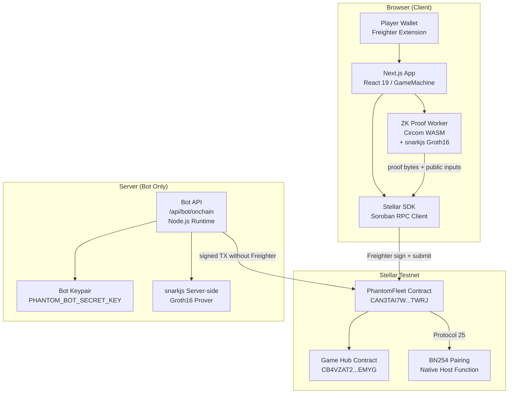
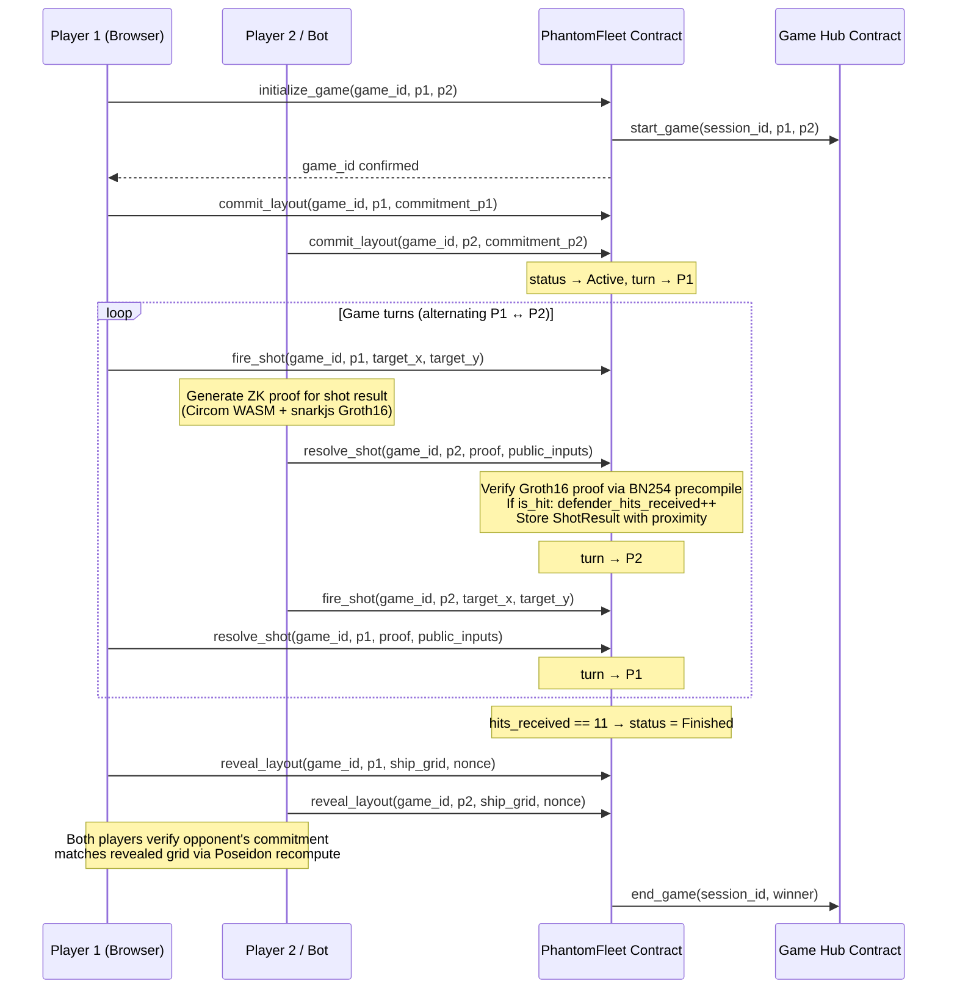
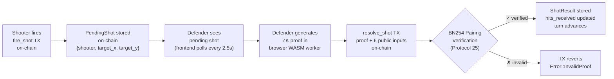
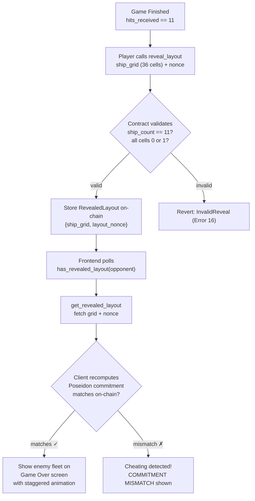
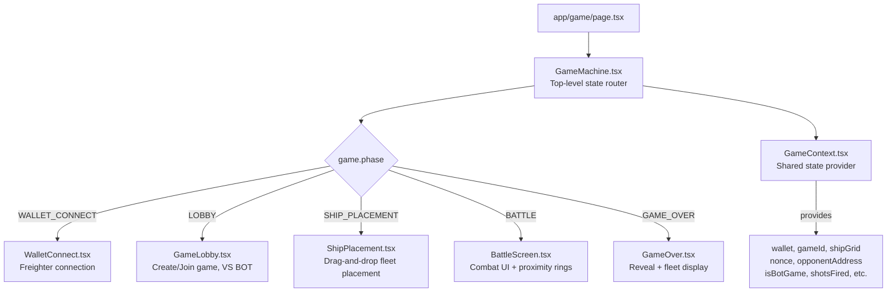
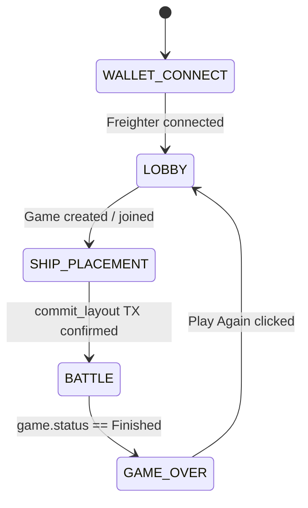
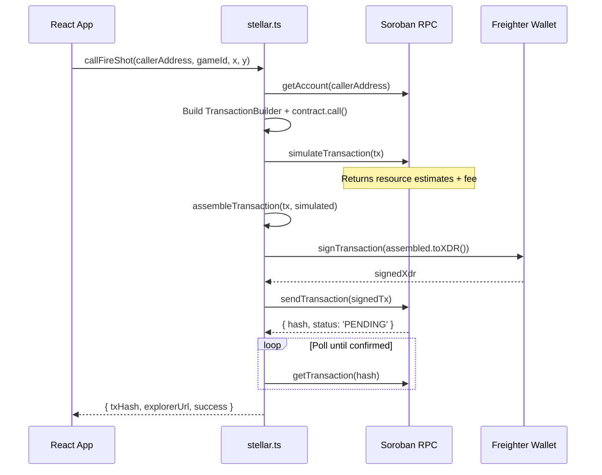
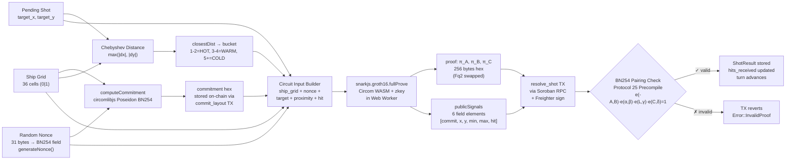

<p align="center">
  
</p>

<h1 align="center">PHANTOM FLEET</h1>

<p align="center">
  <strong>Zero-Knowledge Naval Combat on Stellar Blockchain</strong><br/>
  <em>A fully on-chain battleship game where your fleet is cryptographically invisible — and every shot proves its honesty using ZK proofs.</em>
</p>

<p align="center">
  Stellar · Protocol 25 · BN254 · Groth16 · Circom · Poseidon · Soroban
</p>

<p align="center">
  <a href="https://github.com/pramadanif/phantomfleet">GitHub Repository</a> ·
  <a href="https://phantomfleet.xyz/game">Play on Testnet</a> ·
  Deployed on Stellar Testnet
</p>

---

## Play Now

🎮 **[Play on Testnet →](https://phantomfleet.xyz/game)** (requires [Freighter wallet](https://freighter.app) configured for Stellar Testnet)

> ⚠️ This game runs on **Stellar Testnet** — no real XLM is used. Fund your wallet at [friendbot.stellar.org](https://friendbot.stellar.org).

---

## Table of Contents

1. [What Makes This Different](#1-what-makes-this-different)
2. [Project Overview](#2-project-overview)
3. [Why Stellar Protocol 25?](#3-why-stellar-protocol-25)
4. [Architecture Overview](#4-architecture-overview)
5. [Game Rules & Ship Layout](#5-game-rules--ship-layout)
6. [ZK Circuit — Deep Dive (Circom)](#6-zk-circuit--deep-dive-circom)
   - [6.1 Circuit Source & Artifacts](#61-circuit-source--artifacts)
   - [6.2 Circuit Inputs & Outputs](#62-circuit-inputs--outputs)
   - [6.3 Commitment Scheme (Chunked Poseidon)](#63-commitment-scheme-chunked-poseidon)
   - [6.4 Hit/Miss Honesty Verification](#64-hitmiss-honesty-verification)
   - [6.5 Proximity — Hot & Cold Rings](#65-proximity--hot--cold-rings)
   - [6.6 Chebyshev Distance](#66-chebyshev-distance)
   - [6.7 Full Constraint Breakdown](#67-full-constraint-breakdown)
7. [End-to-End Game Flow](#7-end-to-end-game-flow)
   - [7.1 High-Level Sequence](#71-high-level-sequence)
   - [7.2 Detailed Turn Flow](#72-detailed-turn-flow)
   - [7.3 Reveal Phase](#73-reveal-phase)
8. [Soroban Smart Contract](#8-soroban-smart-contract)
   - [8.1 Data Structures](#81-data-structures)
   - [8.2 Public Functions](#82-public-functions)
   - [8.3 Error Codes](#83-error-codes)
   - [8.4 On-Chain Groth16 Verification](#84-on-chain-groth16-verification)
9. [Frontend Architecture](#9-frontend-architecture)
   - [9.1 Component Tree](#91-component-tree)
   - [9.2 Game State Machine](#92-game-state-machine)
   - [9.3 ZK Proof Worker](#93-zk-proof-worker)
10. [Bot System](#10-bot-system)
    - [10.1 Bot Grid Layout](#101-bot-grid-layout)
    - [10.2 Bot API Route](#102-bot-api-route)
    - [10.3 Deterministic Nonce](#103-deterministic-nonce)
11. [Wallet & Transaction Flow](#11-wallet--transaction-flow)
12. [Proof Encoding & Fq2 Swap](#12-proof-encoding--fq2-swap)
13. [Deployment Guide](#13-deployment-guide)
14. [Testing & E2E Scripts](#14-testing--e2e-scripts)
15. [File Structure](#15-file-structure)
16. [Contract Addresses](#16-contract-addresses)
17. [Environment Variables](#17-environment-variables)
18. [Technical Stack](#18-technical-stack)
19. [Protocol Clarifications](#19-protocol-clarifications)
20. [ZK Proof Data Flow Summary](#20-zk-proof-data-flow-summary)
21. [Hackathon Submission Compliance](#21-hackathon-submission-compliance)

---

## 1. What Makes This Different

Traditional online Battleship has a fundamental trust problem: a central server knows both players' ship layouts, creating opportunities for cheating, data leaks, and manipulation. **Phantom Fleet eliminates the server entirely.** Each player's fleet layout is committed as a **Poseidon hash** on the Stellar blockchain *before the game begins*. No entity — not the opponent, not the contract, not even the game creators — can see where your ships are placed.

The breakthrough mechanic is the **proximity range proof**. In standard Battleship, a miss reveals nothing. In Phantom Fleet, every miss is accompanied by a cryptographic proof revealing *how close* the shot was to the nearest ship — within a Chebyshev distance range like "1-2 cells" (🔴 HOT) or "3-4 cells" (🟡 WARM) — without revealing which ship or in which direction. This proof is generated entirely client-side using a **Circom + SnarkJS Groth16** circuit and verified on-chain via Stellar's **Protocol 25 BN254 precompile**. The result is a game with richer strategy and zero trust assumptions.

---

## 2. Project Overview

**Phantom Fleet** is a fully on-chain, zero-knowledge battleship game built on the **Stellar blockchain** using **Soroban smart contracts** (Protocol 25). It combines:

- A **6×6 grid naval combat** system where ship layouts are secret
- **ZK proofs (Groth16 / BN254)** to verify hit/miss results honestly without revealing the layout
- **Poseidon BN254 hashing** — same hash function in the browser (`circomlibjs`), in the `Circom` circuit, and verified on the Soroban contract
- **Proximity feedback** — even on a miss, the defender must prove how far the nearest ship cell is (hot/cold rings), giving players spatial intelligence without leaking exact positions
- **Freighter wallet** integration for signing on-chain transactions
- **Bot mode** — a server-side AI opponent that automatically commits, fires, resolves shots, and reveals its layout via `/api/bot/onchain`

This game is fully trustless: the only trusted component is the ZK verifying key deployed on-chain. The contract's `resolve_shot()` function calls the BN254 pairing precompile introduced in **Stellar Protocol 25** to verify every proof. Players cannot lie about hits/misses because the proof is verified on-chain before the turn advances.

---

## 3. Why Stellar Protocol 25?

> **"This game cannot exist without Protocol 25."**
> — [`contracts/phantom_fleet/src/lib.rs`](https://github.com/pramadanif/phantomfleet/blob/main/contracts/phantom_fleet/src/lib.rs)

**Before Protocol 25**: verifying a BN254 Groth16 proof would require emulating full elliptic curve pairing arithmetic inside WASM Soroban code. A single pairing check involves hundreds of field multiplications, point additions, and a final exponentiation over a 254-bit prime field. In WASM, this takes **minutes** and consumes prohibitive amounts of gas — making real-time game turns impossible.

**Protocol 25** ([CAP-0074](https://github.com/stellar/stellar-protocol/blob/master/core/cap-0074.md)) introduces **native BN254 host functions** that execute elliptic curve operations in microseconds at minimal cost:

| Host Function | What It Does | Used For |
|---|---|---|
| `bn254.g1_mul(&point, &scalar)` | Scalar multiplication on G1 | Computing `pub_i · IC[i+1]` in linear combination |
| `bn254.g1_add(&p0, &p1)` | Point addition on G1 | Accumulating `L = IC[0] + Σ(pub_i · IC[i+1])` |
| `bn254.pairing_check(g1_vec, g2_vec)` | Multi-pairing check | Final Groth16 equation: `e(-A,B)·e(α,β)·e(L,γ)·e(C,δ) == 1` |

This reduces a full Groth16 verification to **three native host function calls** — from minutes to microseconds.

Protocol 25 also adds **native Poseidon hash primitives** ([CAP-0075](https://github.com/stellar/stellar-protocol/blob/master/core/cap-0075.md)) that allow efficient ZK-friendly hashing both on-chain and off-chain.

**This game cannot exist on Stellar without Protocol 25.** It is not an optimization — it is the enabling technology.

---

## 4. Architecture Overview



**Key architectural decisions:**
- **No backend for PvP** — all game logic runs in the browser + on-chain contract
- **Bot mode only needs `/api/bot/onchain`** — a single Next.js API route that signs with a server-side keypair
- **Proof generation in Web Worker** — keeps the UI responsive during ~5-10 second Groth16 proving
- **Circom WASM artifacts served from `public/`** — the `.wasm` and `.zkey` are loaded by snarkjs at runtime

---

## 5. Game Rules & Ship Layout

The 6×6 grid contains **11 ship cells** total:

| Ship | Size | Cells | Visual |
|------|------|-------|--------|
| Carrier | 4 | ████ | Largest target |
| Cruiser | 3 | ███ | Medium target |
| Destroyer | 2 | ██ | Small target |
| Scout α | 1 | █ | Single cell |
| Scout β | 1 | █ | Single cell |
| **Total** | **11** | | **Win when opponent hits 11** |

Grid indices (row-major, 0-based):

```
Col:  0   1   2   3   4   5
    ┌───┬───┬───┬───┬───┬───┐
R0: │ 0 │ 1 │ 2 │ 3 │ 4 │ 5 │
    ├───┼───┼───┼───┼───┼───┤
R1: │ 6 │ 7 │ 8 │ 9 │10 │11 │
    ├───┼───┼───┼───┼───┼───┤
R2: │12 │13 │14 │15 │16 │17 │
    ├───┼───┼───┼───┼───┼───┤
R3: │18 │19 │20 │21 │22 │23 │
    ├───┼───┼───┼───┼───┼───┤
R4: │24 │25 │26 │27 │28 │29 │
    ├───┼───┼───┼───┼───┼───┤
R5: │30 │31 │32 │33 │34 │35 │
    └───┴───┴───┴───┴───┴───┘
```

Cell `(x, y)` maps to index `y * 6 + x`.

**Turn structure**: Players alternate turns.
- **Phase 1 — Fire**: Current player declares `(target_x, target_y)` on-chain via `fire_shot()`.
- **Phase 2 — Resolve**: Opponent generates a ZK proof proving `is_hit`, `min_dist`, `max_dist`, and submits via `resolve_shot()`.
- Turn passes to next player after resolve.

**Win condition**: A player wins when the opponent's `hits_received == TOTAL_SHIP_CELLS (11)`.

**How to play**:
1. **Connect** your Freighter wallet (set to Stellar Testnet) and create or join a game.
2. **Place** your 5 ships on the 6×6 grid. Your layout is cryptographically sealed — your opponent will never see it.
3. **Fire** shots at your opponent's grid. Defender generates and submits a zero-knowledge proof that verifies hit/miss + proximity without revealing fleet positions. Misses include a proximity ring showing how close you were.
4. The first player to sink all 11 enemy ship cells wins. Every move is permanently recorded on Stellar.

---

## 6. ZK Circuit — Deep Dive (Circom)

### 6.1 Circuit Source & Artifacts

The ZK circuit is written in **Circom 2.1.8** and compiled to a Groth16 R1CS constraint system over the **BN254 curve**.

| Artifact | Location | Description |
|---|---|---|
| **Circuit source** | [`circuits/circom/phantom_fleet.circom`](https://github.com/pramadanif/phantomfleet/blob/main/circuits/circom/phantom_fleet.circom) | Circom 2.1.8 circuit — ~110 lines |
| **WASM** | [`public/circuits/circom/phantom_fleet.wasm`](https://github.com/pramadanif/phantomfleet/blob/main/public/circuits/circom/phantom_fleet.wasm) | Compiled constraint system (loaded by snarkjs) |
| **Proving key** | [`public/circuits/circom/circuit_final.zkey`](https://github.com/pramadanif/phantomfleet/blob/main/public/circuits/circom/circuit_final.zkey) | Groth16 proving key (Phase 2 trusted setup) |
| **Verification key** | [`public/circuits/circom/verification_key.json`](https://github.com/pramadanif/phantomfleet/blob/main/public/circuits/circom/verification_key.json) | JSON VK for local verification / contract upload |

**Dependencies** (from `node_modules`):
- `circomlib/circuits/poseidon.circom` — Poseidon hash template
- `circomlib/circuits/comparators.circom` — `LessThan`, `IsEqual` templates

> **Note**: A legacy Noir implementation exists at `circuits/noir_unused/` but is not used. The active circuit is **Circom**.

### 6.2 Circuit Inputs & Outputs

The circuit `PhantomFleet()` has signals declared as:

```circom
// ─── Private Inputs (known only to defending player) ───
signal input ship_grid[36];     // Full 6×6 flattened layout (0=water, 1=ship)
signal input layout_nonce;      // Random BN254 scalar — commits grid to randomness

// ─── Public Inputs (visible on-chain and to opponent) ───
signal input layout_commitment; // Poseidon hash stored on-chain at commit time
signal input target_x;          // Column where shot was fired (0-5)
signal input target_y;          // Row where shot was fired (0-5)
signal input min_dist;          // Lower bound of Chebyshev proximity ring
signal input max_dist;          // Upper bound of Chebyshev proximity ring
signal input is_hit;            // 0 = miss, 1 = hit
```

**Public inputs declaration** (order MUST match contract expectation):
```circom
component main { public [layout_commitment, target_x, target_y, min_dist, max_dist, is_hit] } = PhantomFleet();
```

This means 6 public signals are emitted by snarkjs as `publicSignals[0..5]`:

| Index | Signal | Type | Description |
|-------|--------|------|-------------|
| 0 | `layout_commitment` | BN254 Field | Poseidon commitment hash |
| 1 | `target_x` | 0-5 | Column fired at |
| 2 | `target_y` | 0-5 | Row fired at |
| 3 | `min_dist` | 0-8 | Lower proximity bound |
| 4 | `max_dist` | 0-8 | Upper proximity bound |
| 5 | `is_hit` | 0 or 1 | Hit/miss result |

### 6.3 Commitment Scheme (Chunked Poseidon)

The commitment ties the defender to their layout before the game starts. It uses a **chunked Poseidon BN254 hash** because Poseidon has a limited input arity (max 16 elements per call in circomlib). The 36-cell grid is split into 3 chunks:

```
chunk1 = Poseidon(15)(grid[0], grid[1], ..., grid[14])
chunk2 = Poseidon(15)(grid[15], grid[16], ..., grid[29])
chunk3 = Poseidon(7)(grid[30], grid[31], ..., grid[35], 0)   ← padded to 7
gridHash = Poseidon(3)(chunk1, chunk2, chunk3)
commitment = Poseidon(2)(gridHash, nonce)
```

**Circom implementation** (from [`phantom_fleet.circom`](https://github.com/pramadanif/phantomfleet/blob/main/circuits/circom/phantom_fleet.circom)):
```circom
component chunk1 = Poseidon(15);
component chunk2 = Poseidon(15);
component chunk3 = Poseidon(7);

for (i = 0; i < 15; i++) {
    chunk1.inputs[i] <== ship_grid[i];
    chunk2.inputs[i] <== ship_grid[15 + i];
}
for (i = 0; i < 6; i++) {
    chunk3.inputs[i] <== ship_grid[30 + i];
}
chunk3.inputs[6] <== 0;

component gridHash = Poseidon(3);
gridHash.inputs[0] <== chunk1.out;
gridHash.inputs[1] <== chunk2.out;
gridHash.inputs[2] <== chunk3.out;

component commitment = Poseidon(2);
commitment.inputs[0] <== gridHash.out;
commitment.inputs[1] <== layout_nonce;
commitment.out === layout_commitment;  // ← CONSTRAINT: commitment must match on-chain value
```

**This exact formula** must be identical across three implementation sites:

| Location | File | Purpose |
|---|---|---|
| **Circuit** | [`circuits/circom/phantom_fleet.circom`](https://github.com/pramadanif/phantomfleet/blob/main/circuits/circom/phantom_fleet.circom) | Enforced in constraint (the proof is invalid if commitment doesn't match) |
| **Browser** | [`src/utils/zkProof.ts`](https://github.com/pramadanif/phantomfleet/blob/main/src/utils/zkProof.ts) — `computeCommitment()` | Used to commit layout at game start + verify opponent reveal |
| **Bot** | [`src/app/api/bot/onchain/route.ts`](https://github.com/pramadanif/phantomfleet/blob/main/src/app/api/bot/onchain/route.ts) — `computeCommitment()` | Bot's server-side commitment computation |
| **Worker** | [`src/workers/prover.worker.ts`](https://github.com/pramadanif/phantomfleet/blob/main/src/workers/prover.worker.ts) — `computeCommitmentDec()` | Pre-computes commitment before calling snarkjs |

Any mismatch between these implementations → `CommitmentMismatch` contract error (Error code 7).

**Nonce generation** — must be a Field element (< BN254 scalar field order):

$$r = 21888242871839275222246405745257275088548364400416034343698204186575808495617$$

Browser nonce generation from [`src/utils/zkProof.ts`](https://github.com/pramadanif/phantomfleet/blob/main/src/utils/zkProof.ts):
```typescript
export function generateNonce(): string {
    const BN254_R = 21888242871839275222246405745257275088548364400416034343698204186575808495617n;
    const bytes = new Uint8Array(31); // 31 bytes = 248 bits, safely below BN254 field
    crypto.getRandomValues(bytes);
    let val = 0n;
    for (const b of bytes) val = (val << 8n) | BigInt(b);
    return (val % BN254_R).toString();
}
```

### 6.4 Hit/Miss Honesty Verification

The circuit ensures the prover cannot lie about whether a shot hit or missed. It uses a **prefix-sum accumulator** to isolate the target cell value without branching:

```circom
signal target_index;
target_index <== target_y * 6 + target_x;

component eqIdx[36];
signal ship_prefix[37];    ship_prefix[0] <== 0;
signal target_prefix[37];  target_prefix[0] <== 0;

for (i = 0; i < 36; i++) {
    // Binary constraint: each cell must be 0 or 1
    ship_grid[i] * (ship_grid[i] - 1) === 0;

    // Check if this index matches target
    eqIdx[i] = IsEqual();
    eqIdx[i].in[0] <== target_index;
    eqIdx[i].in[1] <== i;

    // Accumulate ship count
    ship_prefix[i + 1] <== ship_prefix[i] + ship_grid[i];

    // Accumulate target cell value (only when index matches)
    target_prefix[i + 1] <== target_prefix[i] + eqIdx[i].out * ship_grid[i];
}

// At least one ship must exist on the grid
signal ship_sum;
ship_sum <== ship_prefix[36];
component hasShip = LessThan(7);
hasShip.in[0] <== 0;
hasShip.in[1] <== ship_sum;
hasShip.out === 1;

// The accumulated target cell value must match declared is_hit
signal target_cell;
target_cell <== target_prefix[36];
target_cell === is_hit;
```

**How this works**: The loop walks all 36 cells, checking if each index matches `target_index`. The `IsEqual` gate outputs 1 only for the matching cell. The prefix sum `target_prefix` accumulates `eqIdx.out * ship_grid[i]`, which equals the grid value at the target cell. The final constraint `target_cell === is_hit` ensures the prover declared the correct hit/miss result.

### 6.5 Proximity — Hot & Cold Rings

This is the most distinctive mechanic of Phantom Fleet. On a **miss**, the ZK proof includes a **proximity ring** — `[min_dist, max_dist]` — telling how far the nearest ship cell is from the shot, using **Chebyshev distance**.

**Proximity ring buckets** (computed in client TypeScript, validated in circuit):

| Chebyshev Distance | Ring | UI Color | Label |
|---|---|---|---|
| 1-2 cells | 🔴 Hot | Bright green/red | `HOT` |
| 3-4 cells | 🟡 Warm | Yellow-orange | `WARM` |
| 5+ cells | 🔵 Cold | Blue | `COLD` |

Visual example — shot fired at (3,3), nearest ship at distance 2:

```
     0   1   2   3   4   5
   ┌───┬───┬───┬───┬───┬───┐
0  │   │   │   │   │   │   │
   ├───┼───┼───┼───┼───┼───┤
1  │   │ ▒ │ ▒ │ ▒ │ ▒ │ ▒ │  ← Ring 2 (distance = 2)
   ├───┼───┼───┼───┼───┼───┤
2  │   │ ▒ │ ░ │ ░ │ ░ │ ▒ │  ← Ring 1 inner, Ring 2 outer
   ├───┼───┼───┼───┼───┼───┤
3  │   │ ▒ │ ░ │ ✕ │ ░ │ ▒ │  ← ✕ = shot location
   ├───┼───┼───┼───┼───┼───┤
4  │   │ ▒ │ ░ │ ░ │ ░ │ ▒ │
   ├───┼───┼───┼───┼───┼───┤
5  │   │ ▒ │ ▒ │ ▒ │ ▒ │ ▒ │
   └───┴───┴───┴───┴───┴───┘
░ = distance 1 ring    ▒ = distance 2 ring
```

**Circuit constraints for proximity** (from [`phantom_fleet.circom`](https://github.com/pramadanif/phantomfleet/blob/main/circuits/circom/phantom_fleet.circom)):

```circom
signal is_miss;
is_miss <== 1 - is_hit;

// On a miss: min_dist < 9, max_dist < 9, min_dist <= max_dist
component minBound = LessThan(4);
minBound.in[0] <== min_dist;
minBound.in[1] <== 9;

component maxBound = LessThan(4);
maxBound.in[0] <== max_dist;
maxBound.in[1] <== 9;

component minLeMax = LessThan(4);
minLeMax.in[0] <== min_dist;
minLeMax.in[1] <== max_dist + 1;

is_miss * (1 - minBound.out) === 0;    // miss → min_dist < 9
is_miss * (1 - maxBound.out) === 0;    // miss → max_dist < 9
is_miss * (1 - minLeMax.out) === 0;    // miss → min_dist <= max_dist

// On a hit: proximity must be exactly 0
is_hit * min_dist === 0;
is_hit * max_dist === 0;
```

**How proximity is computed** (in TypeScript, before proof generation):

The actual Chebyshev distance is computed client-side in the prover worker ([`src/workers/prover.worker.ts`](https://github.com/pramadanif/phantomfleet/blob/main/src/workers/prover.worker.ts)):

```typescript
if (!isHit) {
    let closestDist = Infinity;
    for (let i = 0; i < 36; i++) {
        if (witness.shipGrid[i] !== 1) continue;
        const cx = i % 6;
        const cy = Math.floor(i / 6);
        const d = Math.max(Math.abs(witness.targetX - cx), Math.abs(witness.targetY - cy));
        if (d < closestDist) closestDist = d;
    }
    // Bucket into proximity rings
    if (closestDist <= 2) { minDist = 1; maxDist = 2; }
    else if (closestDist <= 4) { minDist = 3; maxDist = 4; }
    else { minDist = 5; maxDist = 8; }
}
```

The circuit validates these values are within bounds. The contract stores them on-chain in `ShotResult.proximity_min` and `ShotResult.proximity_max`. The UI reads these to render the hot/cold rings on the opponent's grid.

### 6.6 Chebyshev Distance

Phantom Fleet uses **Chebyshev distance** (also called L∞ or chessboard distance) instead of Euclidean because:

1. **No square root circuit needed** — saves ~200 constraints
2. **Maps cleanly to concentric rectangular rings** visible on the grid
3. **King moves in chess use the same metric** — intuitive to players

$$d_{Chebyshev}(x_1, y_1, x_2, y_2) = \max(|x_1 - x_2|, |y_1 - y_2|)$$

Implementation in [`src/utils/zkProof.ts`](https://github.com/pramadanif/phantomfleet/blob/main/src/utils/zkProof.ts):

```typescript
export function findClosestShip(
    grid: number[],
    targetX: number,
    targetY: number
): { x: number; y: number; distance: number } {
    let closest = { x: 0, y: 0, distance: Infinity };
    for (let i = 0; i < 36; i++) {
        if (grid[i] !== 1) continue;
        const cellX = i % 6;
        const cellY = Math.floor(i / 6);
        const dist = Math.max(Math.abs(targetX - cellX), Math.abs(targetY - cellY));
        if (dist < closest.distance) {
            closest = { x: cellX, y: cellY, distance: dist };
        }
    }
    if (closest.distance === Infinity) throw new Error('No ship cells found');
    return closest;
}
```

### 6.7 Full Constraint Breakdown

The circuit enforces **5 constraint groups** totaling ~850 R1CS constraints:

| # | Constraint Group | What It Enforces | Approximate Cost |
|---|---|---|---|
| **1** | Bounds Check | `target_x < 6 && target_y < 6` | ~10 constraints |
| **2** | Commitment | `Poseidon(hash_grid(ship_grid), nonce) == layout_commitment` | ~500 constraints |
| **3** | Hit/Miss Honesty | `grid[target_y * 6 + target_x] == is_hit` (via prefix-sum accumulator over 36 cells + 36 `IsEqual` + binary constraints) | ~250 constraints |
| **4** | Ship Existence | At least 1 ship cell exists (`ship_sum > 0`) | ~5 constraints |
| **5** | Proximity Bounds | (miss) `min_dist < 9`, `max_dist < 9`, `min_dist <= max_dist`; (hit) `min_dist == 0`, `max_dist == 0` | ~20 constraints |

**Proof profile:**
- **Proving system**: Groth16 on BN254
- **Proof size**: 256 bytes (3 elliptic curve points: π_A G1 + π_B G2 + π_C G1)
- **Public signals**: 6 field elements (32 bytes each)
- **Target proof time**: <10 seconds in browser WASM via SnarkJS
- **Verification**: Single multi-pairing check on Stellar (Protocol 25)

---

## 7. End-to-End Game Flow

### 7.1 High-Level Sequence



### 7.2 Detailed Turn Flow

Each turn consists of exactly **two on-chain transactions**:



**Proof public inputs vector** (order matters — contract validates this exact order):

```
publicSignals[0] = layout_commitment  (bytes32 Poseidon field element)
publicSignals[1] = target_x           (u32, 0-5)
publicSignals[2] = target_y           (u32, 0-5)
publicSignals[3] = min_dist           (u32, 0-8)
publicSignals[4] = max_dist           (u32, 0-8)
publicSignals[5] = is_hit             (u32, 0 or 1)
```

### 7.3 Reveal Phase

After `status == Finished`, both players reveal their layouts. This is the **trust verification** step:



**Why reveal?** The ZK proofs only prove individual shots were resolved honestly. After the game, players can publicly audit the entire match: was the fleet placement valid? Were all 11 hit claims valid? The reveal lets the loser see the winner's fleet and confirm they genuinely had 11 ships in the right places.

**Reveal flow in [`GameOver.tsx`](https://github.com/pramadanif/phantomfleet/blob/main/src/components/game/screens/GameOver.tsx):**
1. Player's own layout is revealed via `callRevealLayout()`
2. If bot game, bot reveal is triggered via `POST /api/bot/onchain { action: 'reveal' }`
3. Frontend polls `callHasRevealedLayout()` every 2 seconds for up to 60 attempts
4. When opponent reveal is found, `callGetRevealedLayout()` fetches the grid + nonce
5. Client recomputes commitment via `computeCommitment()` and compares to on-chain commitment
6. If match: `enemyShipGrid` is set and the fleet is displayed with staggered cell flip animation
7. If mismatch: `REVEAL RECEIVED BUT COMMITMENT MISMATCH` warning is shown

---

## 8. Soroban Smart Contract

**Source**: [`contracts/phantom_fleet/src/lib.rs`](https://github.com/pramadanif/phantomfleet/blob/main/contracts/phantom_fleet/src/lib.rs) — 1038 lines of Rust

### 8.1 Data Structures

```rust
#[contracttype]
pub struct GameState {
    pub player1: Address,
    pub player2: Address,
    pub p1_commitment: BytesN<32>,    // Poseidon field element as 32 bytes
    pub p2_commitment: BytesN<32>,
    pub p1_hits_received: u32,        // How many of p1's ships have been hit
    pub p2_hits_received: u32,
    pub current_turn: Address,        // Who fires next
    pub status: GameStatus,           // WaitingForCommitments | Active | Finished
    pub turn_number: u32,
    pub session_id: u32,              // From ledger sequence, used by Game Hub
}

#[contracttype]
pub struct ShotResult {
    pub is_hit: bool,
    pub proximity_min: u32,           // Chebyshev ring lower bound (from ZK public input)
    pub proximity_max: u32,           // Chebyshev ring upper bound (from ZK public input)
    pub proof_verified: bool,         // Always true (invalid proofs revert)
    pub tx_sequence: u32,             // Ledger sequence for ordering
}

#[contracttype]
pub struct PendingShot {
    pub shooter: Address,
    pub target_x: u32,
    pub target_y: u32,
}

#[contracttype]
pub struct RevealedLayout {
    pub ship_grid: Vec<u32>,          // 36 cells, each 0 or 1
    pub layout_nonce: BytesN<32>,     // BN254 field element as 32 bytes
}

#[contracttype]
pub enum GameStatus {
    WaitingForCommitments,
    Active,
    Finished,
}
```

### 8.2 Public Functions

| Function | Caller | Auth | Description |
|----------|--------|------|-------------|
| `initialize_game(game_id, p1, p2)` | Player 1 | `player1.require_auth()` | Creates game, calls Hub `start_game()` cross-contract. Enforces `GameAlreadyExists` |
| `commit_layout(game_id, player, commitment)` | Both players | `player.require_auth()` | Stores Poseidon commitment. When both committed → `status = Active` |
| `fire_shot(game_id, shooter, x, y)` | Current turn | `shooter.require_auth()` | Stores `PendingShot`. Rejects if `PendingShotExists` or invalid coords |
| `resolve_shot(game_id, resolver, proof, pubs)` | Defender | `resolver.require_auth()` | Verifies Groth16 proof via Protocol 25, stores `ShotResult`, updates score |
| `submit_shot(game_id, shooter, x, y, proof, pubs)` | Legacy | `shooter.require_auth()` | Combined fire+resolve (backward compat) |
| `reveal_layout(game_id, player, grid, nonce)` | Post-game | `player.require_auth()` | Stores revealed layout. Validates `ship_count == 11` |
| `get_game_state(game_id)` | Anyone | none | Read game state |
| `get_shot_history(game_id)` | Anyone | none | Read all shot results |
| `has_pending_shot(game_id)` | Anyone | none | Boolean check |
| `get_pending_shot(game_id)` | Anyone | none | Read pending shot |
| `has_revealed_layout(game_id, player)` | Anyone | none | Boolean check |
| `get_revealed_layout(game_id, player)` | Anyone | none | Read revealed layout |
| `set_verification_key(admin, vk)` | Admin | `admin.require_auth()` | Upload Groth16 VK (done once at deploy) |
| `has_verification_key()` | Anyone | none | Check VK present (≥ 512 bytes) |

### 8.3 Error Codes

| Code | Name | Meaning |
|------|------|---------|
| 1 | `GameNotFound` | `game_id` doesn't exist in storage |
| 2 | `InvalidStatus` | Action not valid for current game status |
| 3 | `NotYourTurn` | Caller is not `current_turn` |
| 4 | `InvalidPlayer` | Caller is neither `player1` nor `player2` |
| 5 | `InvalidCoordinates` | `x ≥ 6` or `y ≥ 6` |
| 6 | `InvalidProof` | Groth16 pairing check failed or proof wrong size |
| 7 | `CommitmentMismatch` | Proof commitment ≠ stored commitment for resolver |
| 8 | `GameAlreadyFinished` | Game status is already `Finished` |
| 9 | `AlreadyCommitted` | Player already committed a layout |
| 10 | `InvalidPublicInputs` | Wrong number or format of public inputs (need exactly 6) |
| 11 | `VerificationKeyMissing` | No VK uploaded yet |
| 12 | `InvalidVerificationKey` | VK malformed (< 512 bytes or bad alignment) |
| 13 | `PendingShotExists` | Cannot fire while previous shot unresolved |
| 14 | `NoPendingShot` | Cannot resolve with no pending shot |
| 15 | `GameAlreadyExists` | `game_id` collision |
| 16 | `InvalidReveal` | Revealed layout fails validation (wrong cell count, invalid values) |

### 8.4 On-Chain Groth16 Verification

The contract implements `verify_groth16_bn254()` — a 200-line function that performs the full Groth16 pairing check using Protocol 25 host functions.

**The Groth16 verification equation:**

$$e(A, B) = e(\alpha, \beta) \cdot e(L, \gamma) \cdot e(C, \delta)$$

Restructured as **multi-pairing check** (product = 1):

$$e(-A, B) \cdot e(\alpha, \beta) \cdot e(L, \gamma) \cdot e(C, \delta) = 1_{\mathbb{F}_{p^{12}}}$$

Where $L = IC_0 + \sum_{i=1}^{n} pub_i \cdot IC_i$ (linear combination of public inputs with verification key IC points).

**Implementation** (from [`lib.rs`](https://github.com/pramadanif/phantomfleet/blob/main/contracts/phantom_fleet/src/lib.rs)):

```rust
fn verify_groth16_bn254(env: &Env, proof: &Bytes, public_inputs: &Vec<Bytes>, vk: &Bytes) -> bool {
    use soroban_sdk::crypto::bn254::{Bn254G1Affine, Bn254G2Affine, Fr};

    // Extract proof points: A(64 bytes G1) + B(128 bytes G2) + C(64 bytes G1)
    let proof_a = extract_g1(proof, 0);
    let proof_b = extract_g2(proof, 64);
    let proof_c = extract_g1(proof, 192);

    // Extract VK: α(64 G1) + β(128 G2) + γ(128 G2) + δ(128 G2) + IC[0..n](64 each G1)
    let vk_alpha = extract_g1(vk, 0);
    let vk_beta  = extract_g2(vk, 64);
    let vk_gamma = extract_g2(vk, 192);
    let vk_delta = extract_g2(vk, 320);

    // Compute L = IC[0] + Σ(pub_i · IC[i+1])
    let bn254 = env.crypto().bn254();
    let mut vk_x = extract_g1(vk, 448);  // IC[0]
    for i in 0..public_inputs.len() {
        let ic_point = extract_g1(vk, 448 + (i + 1) * 64);
        let scalar = Fr::from_bytes(/* pub_input[i] as 32 bytes */);
        let scaled = bn254.g1_mul(&ic_point, &scalar);
        vk_x = bn254.g1_add(&vk_x, &scaled);
    }

    // Negate A
    let neg_proof_a = -proof_a;

    // 4-pair pairing check: e(-A,B) · e(α,β) · e(L,γ) · e(C,δ) == 1
    let g1_vec = vec![neg_proof_a, vk_alpha, vk_x, proof_c];
    let g2_vec = vec![proof_b, vk_beta, vk_gamma, vk_delta];
    bn254.pairing_check(g1_vec, g2_vec)  // single Protocol 25 host call
}
```

---

## 9. Frontend Architecture

### 9.1 Component Tree



**Key source files:**

| File | Purpose |
|---|---|
| [`src/components/game/GameMachine.tsx`](https://github.com/pramadanif/phantomfleet/blob/main/src/components/game/GameMachine.tsx) | Main game state router — determines which screen to show |
| [`src/components/game/GameContext.tsx`](https://github.com/pramadanif/phantomfleet/blob/main/src/components/game/GameContext.tsx) | React Context: wallet, gameId, shipGrid, nonce, opponentAddress, isBotGame |
| [`src/components/game/screens/WalletConnect.tsx`](https://github.com/pramadanif/phantomfleet/blob/main/src/components/game/screens/WalletConnect.tsx) | Freighter wallet connection screen |
| [`src/components/game/screens/GameLobby.tsx`](https://github.com/pramadanif/phantomfleet/blob/main/src/components/game/screens/GameLobby.tsx) | Create game (PvP or VS BOT), join existing game |
| [`src/components/game/screens/ShipPlacement.tsx`](https://github.com/pramadanif/phantomfleet/blob/main/src/components/game/screens/ShipPlacement.tsx) | Drag-and-drop ship placement + on-chain `commit_layout` |
| [`src/components/game/screens/BattleScreen.tsx`](https://github.com/pramadanif/phantomfleet/blob/main/src/components/game/screens/BattleScreen.tsx) | Main combat UI: fire shots, see proximity, resolve incoming shots |
| [`src/components/game/screens/GameOver.tsx`](https://github.com/pramadanif/phantomfleet/blob/main/src/components/game/screens/GameOver.tsx) | Reveal phase: publish layout, verify opponent, display fleet |

### 9.2 Game State Machine



**BattleScreen polling loop** (runs every 2.5 seconds):
1. Fetch `get_game_state()` — check if game finished, who's turn it is
2. Fetch `has_pending_shot()` — check if there's an incoming shot to resolve
3. If pending shot from opponent → generate ZK proof in Worker → submit `resolve_shot`
4. Fetch `get_shot_history()` — check if our last shot was resolved
5. If new history entry → update enemy grid with HIT/MISS + proximity info
6. If bot game → auto-trigger bot `tick` action

### 9.3 ZK Proof Worker

Groth16 proof generation runs in a **Web Worker** to avoid blocking the UI during the ~5-10 second computation:

**Source**: [`src/workers/prover.worker.ts`](https://github.com/pramadanif/phantomfleet/blob/main/src/workers/prover.worker.ts)

**WASM Assets** (loaded inside worker at runtime from `/public`):
- `public/circuits/circom/phantom_fleet.wasm` — Circom compiled constraint system
- `public/circuits/circom/circuit_final.zkey` — Groth16 proving key

**Worker message protocol:**

```
Main Thread → Worker:
  { type: 'GENERATE_PROOF', witness: { shipGrid, targetX, targetY, layoutNonce } }

Worker → Main Thread:
  { type: 'PROOF_PROGRESS', percent: 5|25|45|80|100 }
  { type: 'PROOF_READY', proof: { proof: base64String, publicInputs: string[] } }
  { type: 'PROOF_ERROR', error: string }
```

**Worker internal steps:**
1. Compute `target_index = targetY * 6 + targetX`, determine `isHit`
2. If miss: compute Chebyshev distance to nearest ship → bucket into proximity ring
3. Compute `commitmentDec` via chunked Poseidon (must match on-chain commitment)
4. Build circuit input object with all private + public inputs
5. Call `snarkjs.groth16.fullProve(input, wasmUrl, zkeyUrl)`
6. Verify `publicSignals[0] == commitmentDec` (sanity check)
7. Encode proof to 256-byte hex blob (with Fq2 coordinate swap for G2 points)
8. Convert to base64 and return with public signals

---

## 10. Bot System

The bot plays entirely server-side, signs transactions with its own keypair (no Freighter required), and generates ZK proofs using `snarkjs` in Node.js.

### 10.1 Bot Grid Layout

**Source**: [`src/app/api/bot/onchain/route.ts`](https://github.com/pramadanif/phantomfleet/blob/main/src/app/api/bot/onchain/route.ts)

The bot's ship layout is hardcoded (11 cells):

```
Col:  0   1   2   3   4   5
    ┌───┬───┬───┬───┬───┬───┐
R0  │   │ ■ │ ■ │ ■ │ ■ │   │  ← Carrier (4 cells, cols 1-4)
    ├───┼───┼───┼───┼───┼───┤
R1  │   │   │   │   │   │   │
    ├───┼───┼───┼───┼───┼───┤
R2  │ ■ │ ■ │ ■ │   │   │   │  ← Cruiser (3 cells, cols 0-2)
    ├───┼───┼───┼───┼───┼───┤
R3  │   │   │   │   │ ■ │ ■ │  ← Destroyer (2 cells, cols 4-5)
    ├───┼───┼───┼───┼───┼───┤
R4  │   │   │   │   │   │   │
    ├───┼───┼───┼───┼───┼───┤
R5  │ ■ │   │   │   │   │ ■ │  ← Scout α (col 0) + Scout β (col 5)
    └───┴───┴───┴───┴───┴───┘
```

Total: 4 + 3 + 2 + 1 + 1 = **11 cells** ✓

### 10.2 Bot API Route

**Endpoint**: `POST /api/bot/onchain`

**Source**: [`src/app/api/bot/onchain/route.ts`](https://github.com/pramadanif/phantomfleet/blob/main/src/app/api/bot/onchain/route.ts)

The single endpoint handles all bot actions based on the `action` field in the request body:

| `action` | What Bot Does | Signs With |
|----------|--------------|------------|
| `commit` | Computes `computeCommitment(BOT_GRID, botNonce)`, calls `commit_layout` | Bot keypair |
| `tick` | Reads game state. If bot must resolve → generate proof + `resolve_shot`. If bot's turn → `fire_shot` at next target | Bot keypair |
| `reveal` | Calls `reveal_layout` with `BOT_GRID` + deterministic nonce | Bot keypair |

**Tick logic:**
```
1. get_game_state(gameId) → if finished, return
2. has_pending_shot(gameId)?
   YES → bot is defender, generate Groth16 proof, call resolve_shot
   NO  → is it bot's turn?
         YES → pick next target, call fire_shot
         NO  → return "waiting for player"
```

The bot selects targets using a deterministic formula based on turn number:
```typescript
function pickBotTarget(turnNumber: number) {
    const idx = Math.abs((turnNumber * 7 + 11) % 36);
    return { x: idx % 6, y: Math.floor(idx / 6) };
}
```

### 10.3 Deterministic Nonce

The bot's commitment nonce is derived deterministically from the game ID, so it can be regenerated at reveal time without needing state storage:

```typescript
function deriveBotNonceDec(gameId: string): string {
    const hash = crypto.createHash('sha256')
        .update(`${BOT_NONCE_SALT}:${gameId}`)
        .digest();
    const raw = BigInt(`0x${hash.toString('hex')}`);
    return (raw % BN254_R).toString();
}
```

`BOT_NONCE_SALT` comes from `PHANTOM_BOT_NONCE_SALT` env var (default: `'phantomfleet-bot'`).

This is critical: if the bot cannot reconstruct its nonce at reveal time, the revealed commitment wouldn't match. By deriving it from `SHA256(salt:gameId)`, the nonce is reproducible with only the game ID.

---

## 11. Wallet & Transaction Flow

All player transactions use the **Freighter** browser extension. The flow in [`src/utils/stellar.ts`](https://github.com/pramadanif/phantomfleet/blob/main/src/utils/stellar.ts):



**Fee**: `10_000_000` stroops (1 XLM max fee) for write transactions. Read-only calls (`get_game_state`, `has_pending_shot`, etc.) use `simulateTransaction` only — no Freighter signature, no fee.

**Address Normalization**: The Soroban SDK sometimes returns addresses as complex XDR objects. [`src/utils/stellar.ts`](https://github.com/pramadanif/phantomfleet/blob/main/src/utils/stellar.ts) handles this with regex extraction:

```typescript
const STELLAR_ADDRESS_REGEX = /G[A-Z2-7]{55}/g;

function normalizeAddress(rawAddress: any): string {
    if (typeof rawAddress === 'string') {
        const match = rawAddress.match(STELLAR_ADDRESS_REGEX);
        if (match && match[0]) return match[0];
        return rawAddress;
    }
    // fallback: recursively walk object for any G... string
    const extracted = extractStellarAddresses(rawAddress);
    if (extracted.length > 0) return extracted[0];
    return String(rawAddress);
}
```

This ensures `callGetGameState` always returns clean `G...` Stellar addresses for `player1`, `player2`, and `currentTurn`, even if the SDK returns nested XDR wrappers.

---

## 12. Proof Encoding & Fq2 Swap

The encoded proof is a **256-byte hex blob** submitted to the contract:

```
Bytes 0-63:    π_A  (G1 point: 32 bytes x + 32 bytes y)
Bytes 64-191:  π_B  (G2 point: 4 × 32 bytes — Fq2 coordinates SWAPPED)
Bytes 192-255: π_C  (G1 point: 32 bytes x + 32 bytes y)
```

**Critical: Fq2 coefficient swap** — The G2 point π_B contains Fq2 elements `(a + b·u)`. SnarkJS outputs them as `[a, b]` but Stellar's host function expects `[b, a]` (coefficients swapped). This swap is implemented in both the worker and bot:

```typescript
function g2ToHexSwapFq2(point: [[string, string], [string, string]]): string {
    const x0 = point[0][1];  // swap [0] and [1] in each Fq2 pair
    const x1 = point[0][0];
    const y0 = point[1][1];
    const y1 = point[1][0];
    return fieldToHex32(x0) + fieldToHex32(x1) + fieldToHex32(y0) + fieldToHex32(y1);
}
```

**Public inputs** are encoded as 32-byte big-endian field elements. Each of the 6 public signals is padded to 32 bytes:

```typescript
function fieldToBytes32(value: string): Buffer {
    return Buffer.from(BigInt(value).toString(16).padStart(64, '0'), 'hex');
}
```

**Verification key** layout (uploaded via `set_verification_key`):
```
Bytes 0-63:    α (G1, 64 bytes)
Bytes 64-191:  β (G2, 128 bytes)
Bytes 192-319: γ (G2, 128 bytes)
Bytes 320-447: δ (G2, 128 bytes)
Bytes 448+:    IC[0], IC[1], ..., IC[n] (each G1, 64 bytes)
```

For 6 public inputs → 7 IC points → VK total = 448 + 7×64 = **896 bytes**.

---

## 13. Deployment Guide

### Prerequisites

- **Rust** + `soroban-cli` / `stellar-cli`
- **Node.js** ≥ 18
- **Circom** + **SnarkJS** (for circuit compilation / trusted setup)
- Stellar TESTNET accounts funded via [Friendbot](https://friendbot.stellar.org)
- [Freighter](https://freighter.app) browser extension installed

### Install Toolchain

```bash
# Install Circom compiler
cargo install --git https://github.com/iden3/circom.git

# Install SnarkJS globally
npm i -g snarkjs

# Install Stellar CLI
cargo install --locked stellar-cli

# Install Rust WASM target
rustup target add wasm32-unknown-unknown

# Generate and fund a testnet keypair
stellar keys generate --network testnet phantom-fleet
curl "https://friendbot.stellar.org?addr=$(stellar keys address phantom-fleet)"
export STELLAR_SECRET_KEY=$(stellar keys show phantom-fleet)
```

### Compile Circuit (if modifying)

```bash
cd circuits/circom

# Compile to R1CS + WASM
circom phantom_fleet.circom --r1cs --wasm --sym -o build/

# Trusted setup (Phase 1 — Powers of Tau)
snarkjs powersoftau new bn128 12 pot12_0000.ptau -v
snarkjs powersoftau contribute pot12_0000.ptau pot12_0001.ptau --name="First"
snarkjs powersoftau prepare phase2 pot12_0001.ptau pot12_final.ptau

# Phase 2 — Circuit-specific
snarkjs groth16 setup build/phantom_fleet.r1cs pot12_final.ptau circuit_0000.zkey
snarkjs zkey contribute circuit_0000.zkey circuit_final.zkey --name="Final"
snarkjs zkey export verificationkey circuit_final.zkey build/verification_key.json

# Copy artifacts to public directory
cp build/phantom_fleet_js/phantom_fleet.wasm ../../public/circuits/circom/
cp circuit_final.zkey ../../public/circuits/circom/
cp build/verification_key.json ../../public/circuits/circom/
```

### Deploy Contract

```bash
# Build WASM
cd contracts/phantom_fleet
cargo build --target wasm32-unknown-unknown --release

# Deploy to testnet
soroban contract deploy \
  --wasm target/wasm32-unknown-unknown/release/phantom_fleet.wasm \
  --source <ADMIN_SECRET_KEY> \
  --network testnet

# Note the returned contract ID → set PHANTOM_FLEET_CONTRACT
```

### Upload Verification Key

```bash
node scripts/extract_vk.mjs
bash scripts/set_vk.sh <CONTRACT_ID> <ADMIN_SECRET_KEY>
```

**Source files:**
- [`scripts/extract_vk.mjs`](https://github.com/pramadanif/phantomfleet/blob/main/scripts/extract_vk.mjs) — Extracts VK from zkey and encodes for contract
- [`scripts/set_vk.sh`](https://github.com/pramadanif/phantomfleet/blob/main/scripts/set_vk.sh) — Calls `set_verification_key` on contract
- [`scripts/deploy.sh`](https://github.com/pramadanif/phantomfleet/blob/main/scripts/deploy.sh) — Full deployment script

### Run Frontend

```bash
npm install
cp .env.local.example .env.local
# Edit .env.local with your bot secret key

npm run dev       # Development (http://localhost:3000/game)
npm run build     # Production build
npm run start     # Production server
```

### Deploy to Vercel

This project is deployable to Vercel with the current architecture.

**Required** environment variables:
```bash
PHANTOM_BOT_SECRET_KEY=<stellar secret for bot wallet>
```

**Recommended** environment variables:
```bash
PHANTOM_FLEET_CONTRACT=CAN3TAI7W6ASCRCVBRIZFC6YXGZ36PPWWFXDDJS35RJ4JSRZEZT2TWRJ
PHANTOM_BOT_NONCE_SALT=phantomfleet-bot
NEXT_PUBLIC_ENABLE_BOT_MODE=1
```

**Notes:**
- `/api/bot/onchain` runs in Node runtime and signs bot transactions server-side
- Keep `public/circuits/circom/phantom_fleet.wasm` and `public/circuits/circom/circuit_final.zkey` in the repo so Vercel server runtime can access them
- **Never** expose `PHANTOM_BOT_SECRET_KEY` to client-side (`NEXT_PUBLIC_*`) variables

---

## 14. Testing & E2E Scripts

### Reveal Layout E2E Test

**Source**: [`scripts/e2e_reveal_layout_circom.mjs`](https://github.com/pramadanif/phantomfleet/blob/main/scripts/e2e_reveal_layout_circom.mjs)

Drives a complete game from initialization → commit → all turns (only hits) → finish → both-player reveal, then verifies:
- `has_revealed_layout` returns `true` for both players
- `get_revealed_layout` returns correct grids
- The Poseidon commitment recomputed from revealed grid matches on-chain commitment

```bash
node scripts/e2e_reveal_layout_circom.mjs
# Expected last line: REVEAL_TEST_PASS=true
```

### Bot E2E Test

**Source**: [`scripts/e2e_bot_finish_circom.mjs`](https://github.com/pramadanif/phantomfleet/blob/main/scripts/e2e_bot_finish_circom.mjs)

Drives a game where the player side is scripted and the bot side is driven via `POST /api/bot/onchain`. Requires `npm run dev` running.

```bash
npm run dev &
node scripts/e2e_bot_finish_circom.mjs
```

### Integration Test

```bash
npx ts-node scripts/test-integration.ts
```

### Build Check

```bash
npm run build
# Should output routes: /, /_not-found, /api/bot/onchain (ƒ), /game
```

---

## 15. File Structure

```
phantomfleet/
│
├── circuits/
│   ├── circom/                             # ✅ Active ZK circuit (Circom 2.1.8)
│   │   ├── phantom_fleet.circom            # Circuit source — commitment + honesty + proximity
│   │   ├── artifacts/                      # Compiled artifacts
│   │   └── build/                          # R1CS output, verification_key.json
│   └── noir_unused/                        # Legacy Noir circuit (not used)
│       ├── src/main.nr
│       └── Nargo.toml
│
├── contracts/phantom_fleet/                # Soroban Rust smart contract
│   ├── src/lib.rs                          # Full contract: 1038 lines
│   └── Cargo.toml
│
├── packages/sdk/src/                       # Reusable SDK
│   ├── phantom-fleet.ts                    # High-level SDK wrapper
│   ├── merkle.ts                           # Merkle tree utilities
│   └── types.ts                            # Shared type definitions
│
├── public/circuits/circom/                 # Circuit assets served to browser
│   ├── phantom_fleet.wasm                  # Circom WASM (loaded by snarkjs)
│   ├── circuit_final.zkey                  # Groth16 proving key
│   └── verification_key.json              # VK for local verification
│
├── scripts/
│   ├── deploy.sh                           # Contract deployment script
│   ├── extract_vk.mjs                      # Extract VK from zkey
│   ├── set_vk.sh                           # Upload VK to contract
│   ├── simulate.ts                         # Manual proof simulation
│   ├── test-integration.ts                 # Integration test
│   ├── e2e_reveal_layout_circom.mjs        # ✅ E2E reveal test (CONFIRMED PASSING)
│   └── e2e_bot_finish_circom.mjs           # E2E bot test
│
├── src/
│   ├── app/
│   │   ├── page.tsx                        # Landing page
│   │   ├── layout.tsx                      # Root layout
│   │   ├── globals.css                     # Global styles (Tailwind v4)
│   │   ├── game/page.tsx                   # Game route — loads GameMachine
│   │   └── api/bot/onchain/route.ts        # Bot server-side API (Node.js runtime)
│   │
│   ├── components/
│   │   ├── game/
│   │   │   ├── GameMachine.tsx             # Game state router (5 phases)
│   │   │   ├── GameContext.tsx             # Shared context provider
│   │   │   └── screens/
│   │   │       ├── WalletConnect.tsx       # Freighter connection
│   │   │       ├── GameLobby.tsx           # PvP / VS BOT creation & join
│   │   │       ├── ShipPlacement.tsx       # Drag-and-drop + on-chain commit
│   │   │       ├── BattleScreen.tsx        # Combat UI + proximity rings + polling
│   │   │       └── GameOver.tsx            # Reveal phase + enemy fleet animation
│   │   ├── layout/
│   │   │   ├── NavBar.tsx                  # Navigation bar
│   │   │   ├── Footer.tsx                  # Footer
│   │   │   └── SectionDivider.tsx          # Visual divider
│   │   ├── sections/                       # Landing page sections
│   │   │   ├── HeroSection.tsx
│   │   │   ├── ArchitectureSection.tsx
│   │   │   ├── MechanicsSection.tsx
│   │   │   ├── Protocol25Section.tsx
│   │   │   ├── ProximitySection.tsx
│   │   │   ├── DeploySection.tsx
│   │   │   └── StatsBar.tsx
│   │   └── effects/
│   │       ├── GrainOverlay.tsx            # Film grain effect
│   │       └── ScanlineOverlay.tsx         # CRT scanline effect
│   │
│   ├── utils/
│   │   ├── stellar.ts                      # All Soroban RPC + Freighter + address utilities
│   │   ├── zkProof.ts                      # Poseidon, commitment, Merkle tree, nonce
│   │   ├── botEngine.ts                    # Client-side bot helper
│   │   └── soundEngine.ts                  # Game audio (hit, miss, sonar, victory/defeat)
│   │
│   └── workers/
│       └── prover.worker.ts                # Web Worker: Circom Groth16 proof generation
│
├── package.json                            # Dependencies: snarkjs, circomlibjs, stellar-sdk, etc.
├── next.config.mjs                         # Next.js 16 config (webpack mode)
├── tsconfig.json
├── postcss.config.mjs                      # Tailwind v4 PostCSS config
└── phantomfleetlogo.png                    # Project logo
```

---

## 16. Contract Addresses

| Contract | Address | Network | Explorer |
|----------|---------|---------|----------|
| PhantomFleet Game | `CAN3TAI7W6ASCRCVBRIZFC6YXGZ36PPWWFXDDJS35RJ4JSRZEZT2TWRJ` | Stellar Testnet | [View](https://stellar.expert/explorer/testnet/contract/CAN3TAI7W6ASCRCVBRIZFC6YXGZ36PPWWFXDDJS35RJ4JSRZEZT2TWRJ) |
| Game Hub | `CB4VZAT2U3UC6XFK3N23SKRF2NDCMP3QHJYMCHHFMZO7MRQO6DQ2EMYG` | Stellar Testnet | [View](https://stellar.expert/explorer/testnet/contract/CB4VZAT2U3UC6XFK3N23SKRF2NDCMP3QHJYMCHHFMZO7MRQO6DQ2EMYG) |

---

## 17. Environment Variables

| Variable | Required | Description |
|----------|----------|-------------|
| `PHANTOM_BOT_SECRET_KEY` | **Required** (for bot) | Stellar secret key (`S...`) for bot transaction signing |
| `PHANTOM_BOT_NONCE_SALT` | Optional | Salt for deterministic nonce derivation (default: `phantomfleet-bot`) |
| `PHANTOM_FLEET_CONTRACT` | Optional | Override contract address (default: hardcoded testnet address) |
| `NEXT_PUBLIC_ENABLE_BOT_MODE` | Optional | Set to `1` to enable VS BOT button in lobby |

Create `.env.local`:
```env
PHANTOM_BOT_SECRET_KEY=SXXXXXXXXXXXXXXXXXXXXXXXXXXXXXXXXXXXXXXXXXXXXXXXXXXXXXXXXX
PHANTOM_BOT_NONCE_SALT=phantomfleet-bot
PHANTOM_FLEET_CONTRACT=CAN3TAI7W6ASCRCVBRIZFC6YXGZ36PPWWFXDDJS35RJ4JSRZEZT2TWRJ
NEXT_PUBLIC_ENABLE_BOT_MODE=1
```

---

## 18. Technical Stack

| Layer | Technology | Version |
|---|---|---|
| **ZK Circuit** | [Circom](https://docs.circom.io) | 2.1.8 |
| **Proving System** | Groth16 on BN254 via [SnarkJS](https://github.com/iden3/snarkjs) | 0.7.6 |
| **Hash Function** | Poseidon BN254 via [circomlibjs](https://github.com/iden3/circomlibjs) | 0.1.7 |
| **Smart Contract** | [Soroban](https://soroban.stellar.org) (Rust → WASM) | Protocol 25 |
| **On-Chain Verification** | Stellar Protocol 25 BN254 precompile ([CAP-0074](https://github.com/stellar/stellar-protocol/blob/master/core/cap-0074.md)) | — |
| **Blockchain** | [Stellar](https://stellar.org) Testnet | — |
| **Frontend** | [Next.js](https://nextjs.org) | 16.1.6 |
| **UI Framework** | [React](https://react.dev) | 19 |
| **Animation** | [Framer Motion](https://www.framer.com/motion/) (via `motion`) | 12+ |
| **Styling** | [Tailwind CSS](https://tailwindcss.com) | 4 |
| **Wallet** | [Freighter](https://freighter.app) browser extension | 6+ |
| **Stellar SDK** | [@stellar/stellar-sdk](https://github.com/stellar/js-stellar-sdk) | 14.5 |
| **Design** | Custom military-grade aesthetic — no border-radius, crosshair cursor, brass/abyss palette | — |

---

## 19. Protocol Clarifications

- **Two-phase shot lifecycle (current implementation)**: Shooter submits `fire_shot(target)`, then defender submits `resolve_shot(proof, public_inputs)`. These are two separate on-chain transactions.

- **Why two-phase**: Only the defender possesses the private layout + nonce needed to generate a valid ZK proof against their own commitment. The shooter cannot generate the proof because they don't know the defender's grid.

- **Legacy compatibility**: `submit_shot()` still exists in the contract for backward compatibility (combines fire + resolve in one TX), but the active frontend flow uses `fire_shot → resolve_shot`.

- **Game ID model**: `game_id` is a 32-byte value supplied by the frontend (derived from the game ID string). The contract enforces uniqueness via `GameAlreadyExists` error to prevent collisions.

- **Session ID**: The contract generates a `session_id` from the ledger sequence number. This ID is passed to the Game Hub contract via `start_game()` and `end_game()` cross-contract calls.

- **Turn alternation**: After `resolve_shot`, the turn passes to the resolver (defender becomes the next shooter). This ensures strict alternation: P1 fires → P2 resolves → P2 fires → P1 resolves → ...

---

## 20. ZK Proof Data Flow Summary



---

## 21. Hackathon Submission Compliance

| Requirement | Status | Details |
|---|---|---|
| ✅ ZK-Powered Mechanic | **Core** | Every resolved shot generates a real Groth16 ZK proof (Circom + SnarkJS) proving hit/miss + proximity range without revealing fleet positions |
| ✅ Deployed Onchain | **Testnet** | Contract `CAN3TAI7W...TWRJ` calls `start_game()` and `end_game()` on Game Hub `CB4VZAT…EMYG` via cross-contract invocation |
| ✅ Protocol 25 BN254 | **Required** | `bn254.g1_mul`, `bn254.g1_add`, `bn254.pairing_check` — game cannot exist without these host functions |
| ✅ Front End | **Functional** | 5-screen React game: wallet connect → lobby → ship placement → real-time battle → game over with fleet reveal |
| ✅ Bot Opponent | **Functional** | Server-side bot via `/api/bot/onchain` with deterministic nonce + automatic proof generation |
| ✅ Reveal & Verify | **Functional** | Post-game reveal: both players publish layouts, client verifies Poseidon commitment match |
| ✅ Open-source Repo | **Public** | [github.com/pramadanif/phantomfleet](https://github.com/pramadanif/phantomfleet) — full source code with this README |
| ⬜ Video Demo | **Pending** | 2-3 minute demonstration of gameplay + ZK explanation |

---

<p align="center">
  <strong>Phantom Fleet — Zero-Knowledge Naval Combat — Stellar · Protocol 25</strong><br/>
  Repository: <a href="https://github.com/pramadanif/phantomfleet">github.com/pramadanif/phantomfleet</a>
</p>
